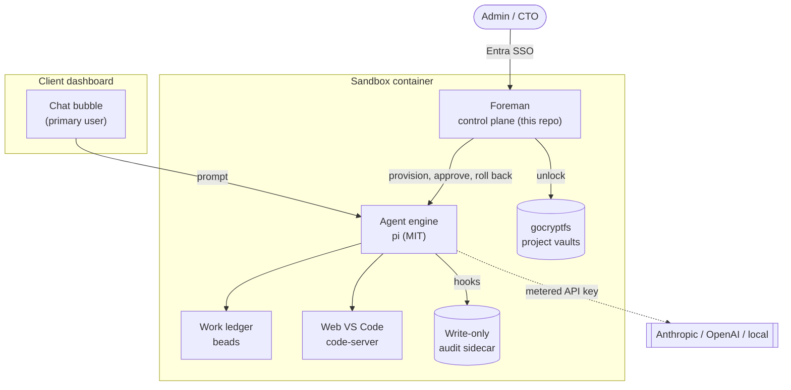

# Client Dev Sandbox

A self-contained dev sandbox for a client team. A primary user sees a chat bubble in their own
dashboard and hands the agent problems bigger than their interface. An admin runs the box through
**Foreman**, the web control plane in this repo. The agent layer does large, structural changes to
the sandbox itself, each one bracketed by a snapshot it can roll back. Everything shipped is
permissively licensed.

This README is the map. It shows what the product is, what is built so far, and where each piece
lives.

Two rules shape every decision, both from the client:

- **A distillation, not agentbox.** A plain container with few moving parts and TOML-gated
  bundles. The maximalist in-house machine (agentbox) stays in-house.
- **Maintainability beats capability.** Fewest tools, one per job, narrow interfaces we own.

## The whole system



The primary user never sees Foreman. Foreman is for the person who owns the box: provisioning,
watching activity, approving or rolling back overhauls, reading the audit trail.

## Foreman — the control plane (built, mock-backed)

Six tabs, each opening with plain guidance on when and why to use it. Built as a Vite + React +
TypeScript app against a mock data seam, so the design can be judged before anything is
containerised (see [ADR-001](docs/reference/adr/ADR-001-stack-and-mock-first.md)).

| Tab | What it answers | When to use it |
|---|---|---|
| **Overview** | Is the box healthy and busy? | First thing each session |
| **Visualiser** | Who did what, to what, when? | Trace an owner's blast radius, spot a rogue agent |
| **Activity** | What is happening right now? | Follow a live session, audit one agent |
| **Work** | What is the agent doing over the long run? | Track overhaul work, approve a gated overhaul |
| **Configuration** | What can I change, and how does it land? | Provision a client, change providers, plan a rebuild |
| **Operations** | Can I undo this, and prove what changed? | Roll back, verify the audit chain, unlock a vault |

### The signature idea: apply-class

Every configuration option is one of three classes, shown as a coloured badge at the point of
change, so the operator always knows whether a toggle is instant or triggers a rebuild.

```mermaid
flowchart LR
  change([Change a setting]) --> q{Apply-class}
  q -->|live| l["Applies now\nto the running box"]
  q -->|session| s["Applies to\nnew sessions"]
  q -->|rebuild| r["Write TOML → build image\n→ healthcheck → blue/green\n→ auto-rollback on failure"]
  style l fill:#0e2b28,stroke:#33c2b4
  style s fill:#2b2410,stroke:#f0a53a
  style r fill:#2b1216,stroke:#f0596b
```



Rebuild is the only class that can break the box, so it is the only one routed through a reviewed
plan with a snapshot and auto-rollback. Full rationale in
[ADR-002](docs/reference/adr/ADR-002-apply-class-model.md).

## Repo map

```
devContainer/
├── README.md                 ← you are here: the design map
├── app/                      ← Foreman, the control-plane UI (Vite + React + TS)
│   └── src/
│       ├── domain/types.ts   ← frozen domain contract
│       ├── data/adapter.ts    ← the seam: swap mock for a real backend here alone
│       ├── data/mock.ts       ← deterministic seeded world (no backend)
│       ├── ui/primitives.tsx  ← shared components (ApplyBadge, OwnerTag, WhenToUse…)
│       └── features/          ← one directory per tab (built by a mesh of agents)
├── docs/
│   ├── vision-brief.md        ← the product vision and steers
│   ├── gap-analysis.md         ← what research covered, what is parked
│   ├── client-questions.md     ← questions for the client brief
│   └── reference/
│       ├── prd/                ← product requirements (PRD-000 shape, PRD-001 control plane)
│       ├── adr/                ← architecture decisions (001 stack, 002 apply-class, 003 visualiser)
│       ├── ddd/                ← domain model (DDD-001)
│       └── future/             ← stubs for milestones not yet built
├── corpus/                    ← the research corpus (13 sections, licence-verified)
└── data/options.json          ← machine-readable option dataset
```

## Documents

Start with the shape, then the control-plane specifics:

- [PRD-000 — Product shape and roadmap](docs/reference/prd/PRD-000-product-shape.md)
- [PRD-001 — Control plane](docs/reference/prd/PRD-001-control-plane.md)
- [DDD-001 — Domain model](docs/reference/ddd/DDD-001-control-plane-domain.md)
- ADR [001 stack](docs/reference/adr/ADR-001-stack-and-mock-first.md) ·
  [002 apply-class](docs/reference/adr/ADR-002-apply-class-model.md) ·
  [003 visualiser](docs/reference/adr/ADR-003-visualiser-rendering.md)
- [Future stubs](docs/reference/future/ROADMAP-STUBS.md)

## Roadmap

```mermaid
flowchart LR
  M1["M1 · Control plane UI\n(mock-backed) ✓ now"] --> M2["M2 · Backend\nHono + adapters"]
  M2 --> M3["M3 · Agent engine\npi embed"]
  M3 --> M4["M4 · Container\nrebuild + rollback"]
  M4 --> M5["M5 · Identity\nEntra + tunnels"]
  M5 --> M6["M6 · Audit + vaults"]
  M6 --> M7["M7 · Chat bubble"]
  style M1 fill:#12233b,stroke:#5b8cff
```



## Research corpus

The design rests on a licence-verified survey of the field (all claims checked against the GitHub
API or a raw LICENSE read on 2026-07-16; several popular projects' badges are wrong). Highlights:
the agent engine is **pi (MIT)** rather than the proprietary Claude Code CLI; the work ledger is
**beads (MIT)** behind a narrow interface; **Gemma 4 is Apache-2.0** so the embedded model is
licence-clean. Full detail and the traps found (Open WebUI's custom licence, immudb's BSL, Redis
8's tri-licence, Daytona shipping no licence at all) are in [`corpus/`](corpus/), indexed by
[`corpus/README.md`](corpus/README.md).

## Running Foreman

```bash
cd app
pnpm install
pnpm dev        # http://localhost:5173
```

No backend needed. The app renders a deterministic mock world seeded from one PRNG, so every load
shows the same sandbox. Swapping to a real backend later is a rewrite of `app/src/data/adapter.ts`
and nothing else.
