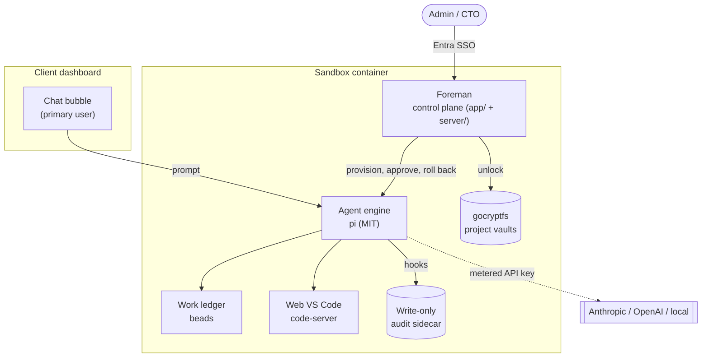
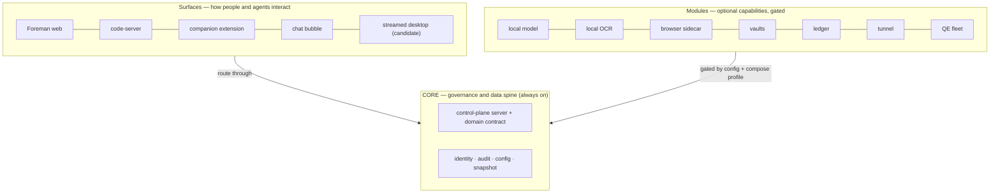

# docBox

A self-contained dev sandbox for a client team. A primary user sees a chat bubble in their own
dashboard and hands the agent problems bigger than their interface. An admin runs the box through
**Foreman**, the web control plane in this repo. The agent layer makes large, structural changes
to the sandbox itself, each one bracketed by a snapshot it can roll back. Everything in the default
box is permissively licensed; the one exception is opt-in — enabling the browser-sidecar module
pulls Google Chrome (proprietary), a deliberate choice for a structurally undetectable agent
browser.

This README is the map: what the product is, what is built, and where each piece lives.

New here? The [getting-started guide](docs/getting-started.md) is a 60-second first-run tour, and the
[glossary](docs/glossary.md) defines every term on one screen.

Two rules shape every decision, both from the client:

- **A distillation, not agentbox.** A plain container with few moving parts and TOML-gated
  bundles. The maximalist in-house machine (agentbox) stays in-house.
- **Maintainability beats capability.** Fewest tools, one per job, narrow interfaces we own.

## System shape



The primary user never sees Foreman. Foreman is for the person who owns the box: provisioning,
watching activity, approving or rolling back overhauls, reading the audit trail.

## Core and modules

The organising idea, and what keeps the product a distillation rather than a monolith: a **slim
core** with **surfaces** and **modules** around it ([ADR-009](docs/reference/adr/ADR-009-slim-core-surfaces-as-modules.md)).



- **Core** is the spine, not any UI: the server + frozen domain contract + the four invariants
  (identity, audit, apply-class, snapshot). It stays small, structured, and always-on.
- **Surfaces** are rich, but their state-changing actions route through the core contract, so the
  audit boundary sits at the core. That is what lets a heavy surface (a streamed desktop) coexist
  with a strict audit story.
- **Modules** are three things and no more: a compose service (profile-gated when optional), a
  config entry with an apply-class, and a reach to the core API. Adding a capability is adding a
  module, never changing the core. The **System** tab renders this manifest live.

This is a stated convention, not a plugin framework: we stop at the deployment seam, which is what
keeps it a tenth of agentbox's surface.

## What is built

| Layer | Status | Where |
|---|---|---|
| **Foreman UI** — eight-tab control plane | UI built (mock); host-runtime pending | `app/` |
| **Control-plane server** — Hono, serves the world + SSE, TOML config, documents | Built, verified | `server/` |
| **Companion extension** — code-server sidebar (chat + documents) | Scaffolded, compile-checked | `extension/` |
| **Container definitions** — control-plane / audit / vault / browser images, egress firewall, oauth2-proxy | Written, compose-validated (images build on a host; DinD) | `docker/`, `scripts/` |
| **Agent engine** — typed seam + deterministic mock; live `pi` over RPC (stdio) | Seam + mock built, tested | `server/src/engine/` |
| **Audit trail** — control plane emits attributed events → write-only, hash-chained sidecar | Built, tested; actor from oauth2-proxy headers | `server/src/audit/` |
| Identity (Entra + oauth2-proxy), tunnels, vaults, chat bubble | Specified; config written, host-runtime | `docs/`, `docker/` |

Foreman runs against a mock world by default (offline, deterministic) and, with
`VITE_DATA_MODE=live`, hydrates from the control-plane server instead — which, in dev, re-serves the
same seeded world ([mock-to-live](docs/mock-to-live.md) walks the three rungs from demo to real). The
feature modules never change when data goes live: they read a synchronous adapter seam, and only that
seam knows whether data is mock or live. That is the promise
[ADR-001](docs/reference/adr/ADR-001-stack-and-mock-first.md) makes: the seam is proven; live host
behaviour is M3–M6 host-runtime.

## Foreman — the tabs

Each opens with plain guidance on when and why to use it. In demo mode (the default) every figure
below is from the seeded mock world.

| Tab | What it answers | When to use it |
|---|---|---|
| **Overview** | Is the box healthy and busy? | First thing each session |
| **Visualiser** | Who did what, to what, when? | Trace an owner's blast radius, spot a rogue agent |
| **Activity** | What is happening right now? | Follow a live session, audit one agent |
| **Work** | What is the agent doing over the long run? | Track overhaul work, approve a gated overhaul |
| **Documents** | What has been uploaded, and did it stay private? | Upload scans/forms, watch OCR, confirm handwriting, see local vs cloud routing |
| **Configuration** | What can I change, and how does it land? | Provision a client, change providers, plan a rebuild, adjust the layout |
| **Operations** | Can I undo this, and prove what changed? | Roll back, verify the audit chain, unlock a vault |
| **System** | What is the box made of, and what is on? | See the slim core, its surfaces and modules, and which are enabled |

### Signature idea: apply-class

Every configuration option is one of four classes, shown as a coloured badge at the point of
change, so the operator always knows whether a change is instant, waits for a new session, or
triggers a rebuild.

```mermaid
flowchart LR
  change([Change a setting]) --> q{Apply-class}
  q -->|hot| h["Interface edit\nvia hot reload / manifest\nsub-second"]
  q -->|live| l["Applies now\nto the running box"]
  q -->|session| s["Applies to\nnew sessions"]
  q -->|rebuild| r["Write TOML → build image\n→ healthcheck → blue/green\n→ auto-rollback on failure"]
  style h fill:#221a33,stroke:#a06bff
  style l fill:#0e2b28,stroke:#33c2b4
  style s fill:#2b2410,stroke:#f0a53a
  style r fill:#2b1216,stroke:#f0596b
```



Rebuild is the only class that can break the box, so it is the only one routed through a reviewed
plan with a snapshot and auto-rollback. Hot is the interface editing itself: layout is data and
each panel is isolated, so a hot edit cannot break the box or blank the interface. Rationale in
[ADR-002](docs/reference/adr/ADR-002-apply-class-model.md) and
[ADR-008](docs/reference/adr/ADR-008-live-self-modifying-interface.md).

## Repo map

```
docBox/
├── README.md                 ← the design map (this file)
├── app/                      ← Foreman UI (Vite + React + TS)
│   └── src/
│       ├── domain/types.ts   ← frozen domain contract
│       ├── data/adapter.ts    ← the seam: mock or live, feature modules never know
│       ├── data/mock.ts       ← deterministic seeded world
│       ├── data/live.ts       ← hydrate from the server + SSE subscription
│       └── features/          ← one directory per tab
├── server/                   ← control-plane (Hono): /api/world·config·events·documents·engine; engine/ + audit/ seams
├── extension/                ← code-server companion (VS Code sidebar): chat + documents dock (ADR-007)
├── docker/                   ← Dockerfiles (sandbox + control-plane/audit/vault/browser), compose, foreman.toml, README
├── scripts/                  ← rebuild.sh (blue/green), rollback.sh, init-firewall.sh (egress allowlist)
├── docs/reference/           ← PRD / ADR / DDD
├── corpus/                   ← licence-verified research
└── .github/                  ← CI (typecheck, boundary gate, build, tests, prose gate, secret scan)
```

## Running it

> **What you'll see on first run.** `pnpm dev:app` opens a fabricated demo world — every owner,
> agent, action and document is invented; nothing is real until you go live. Two tells confirm it: a
> **demo banner** across the top of every screen, and the header's **`mock` badge** recoloured to the
> demo tint. Both self-erase the moment real control-plane data hydrates. New to the box? Take the
> [getting-started tour](docs/getting-started.md); [mock-to-live](docs/mock-to-live.md) explains the
> three rungs; [troubleshooting](docs/troubleshooting.md) covers the first-run snags.

```bash
pnpm install

# offline: the deterministic mock world, no server needed
pnpm dev:app                        # http://localhost:5173

# live: the control-plane server + the UI hydrating from it
pnpm dev:server                     # http://127.0.0.1:8787  (terminal 1)
cd app && VITE_DATA_MODE=live pnpm dev   # http://localhost:5173  (terminal 2)
```

The container image builds on a real host with Docker, not in this dev environment (a
bind-mount limitation). See [docker/README.md](docker/README.md) for the build and run sequence.

## Documents

Operator guides — start here:

- [Getting started](docs/getting-started.md) — a 60-second first-run tour of the demo world and the eight-tab loop.
- [Mock to live](docs/mock-to-live.md) — the three rungs from the offline demo to a real datastore, and why a `live` badge can sit over seeded data.
- [Glossary](docs/glossary.md) — every term on one screen: owner, session, agent, action, apply-class, snapshot, bead, gate, audit record.
- [Troubleshooting](docs/troubleshooting.md) — the five things most likely to snag a first run.

Reference record:

- [PRD-000 — Product shape and roadmap](docs/reference/prd/PRD-000-product-shape.md)
- PRD [001 control plane](docs/reference/prd/PRD-001-control-plane.md) ·
  [002 backend](docs/reference/prd/PRD-002-control-plane-backend.md) ·
  [003 agent engine](docs/reference/prd/PRD-003-agent-engine.md) ·
  [004 container/rebuild](docs/reference/prd/PRD-004-container-and-rebuild.md) ·
  [005 identity/network](docs/reference/prd/PRD-005-identity-and-network.md) ·
  [006 audit/vaults](docs/reference/prd/PRD-006-audit-and-vaults.md) ·
  [007 documents/OCR](docs/reference/prd/PRD-007-documents-and-ocr.md)
- ADR [001](docs/reference/adr/ADR-001-stack-and-mock-first.md) ·
  [002](docs/reference/adr/ADR-002-apply-class-model.md) ·
  [003](docs/reference/adr/ADR-003-visualiser-rendering.md) ·
  [004](docs/reference/adr/ADR-004-config-persistence-toml.md) ·
  [005](docs/reference/adr/ADR-005-live-event-transport.md) ·
  [006](docs/reference/adr/ADR-006-snapshot-store.md) ·
  [007 primary-user surface](docs/reference/adr/ADR-007-primary-user-surface.md) ·
  [008 self-modifying interface](docs/reference/adr/ADR-008-live-self-modifying-interface.md) ·
  [009 slim core/modules](docs/reference/adr/ADR-009-slim-core-surfaces-as-modules.md) ·
  [010 panel registry + boundary gate](docs/reference/adr/ADR-010-panel-registry-and-boundary-gate.md)
- DDD [001 domain model](docs/reference/ddd/DDD-001-control-plane-domain.md) ·
  [002 overhaul lifecycle](docs/reference/ddd/DDD-002-overhaul-lifecycle.md) ·
  [003 interface domain](docs/reference/ddd/DDD-003-interface-domain.md)

## Roadmap

```mermaid
flowchart LR
  M1["M1 · Control plane UI\n✓ built"] --> M2["M2 · Backend\n✓ built"]
  M2 --> M3["M3 · Agent engine\npi embed"]
  M3 --> M4["M4 · Container\nrebuild + rollback"]
  M4 --> M5["M5 · Identity\nEntra + tunnels"]
  M5 --> M6["M6 · Audit + vaults"]
  M6 --> M7["M7 · Chat bubble"]
  style M1 fill:#0e2b28,stroke:#33c2b4
  style M2 fill:#0e2b28,stroke:#33c2b4
  style M3 fill:#2b2410,stroke:#f0a53a
  style M4 fill:#2b2410,stroke:#f0a53a
  style M5 fill:#2b2410,stroke:#f0a53a
  style M6 fill:#2b2410,stroke:#f0a53a
```



Green is shipped and judged, amber is in progress (M3–M6: seams built, host-runtime wiring remains),
unstyled M7 is not started.

M3's engine seam and M6's audit service are built and tested behind the adapter pattern
(`server/src/engine/`, `server/src/audit/`); M4's container definitions and the default-deny egress
boundary are written and compose-validated. What remains is host-runtime wiring — a live `pi`
process, the running audit sidecar, real Entra/OIDC and tunnel secrets — which turns on when the
images are built on a real host.

## Research corpus

The design rests on a licence-verified survey of the field (checked against the GitHub API or a
raw LICENSE read on 2026-07-16; several popular projects' badges are wrong). The agent engine is
**pi (MIT)** rather than the proprietary Claude Code CLI; the work ledger is **beads (MIT)** behind
a narrow interface; the embedded local model is **Qwen3-8B (Apache-2.0)**, so it ships licence-clean. Full detail,
and the traps found (Open WebUI's custom licence, immudb's BSL, Redis 8's tri-licence, Daytona
shipping no licence), are indexed in [`corpus/README.md`](corpus/README.md).

## Licence

[Apache-2.0](LICENSE). Contributions welcome under the same terms; see
[CONTRIBUTING.md](CONTRIBUTING.md).
