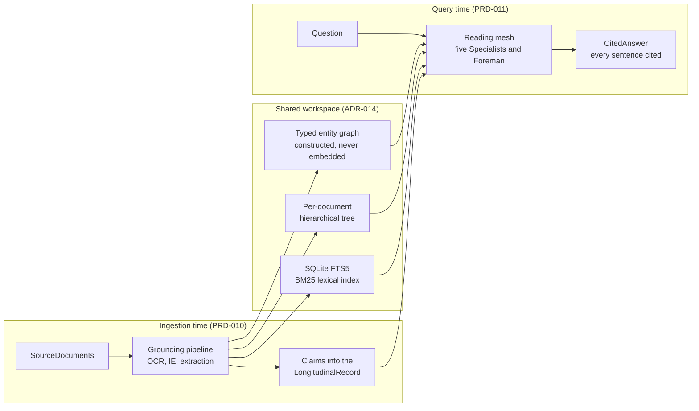

# ADR-011 — Context-Native Retrieval

Status: Accepted · Date: 2026-07-17 · Deciders: DreamLab

## Context

The demonstrator answers a clinician's Questions over one synthetic patient's record — roughly
50–100 mixed SourceDocuments once the letters, reports, notes, e-consults and scanned artefacts are
counted ([demonstrator brief](../../demonstrator-brief.md)). The reflex answer in 2026 is a
vector-RAG backbone: chunk the corpus, embed the chunks, ANN-search at query time, stuff top-k into
a prompt. We tested that reflex against what a longitudinal record actually needs, and it fails on
exactly the axes the record turns on:

- **Similarity is not relevance, and it is blind to time.** Cosine distance returns the *most
  similar* passage, never the *most recent* or the *superseding* one. Supersession and
  Contradiction are first-class objects in this product; embedding similarity has no representation
  of either.
- **Chunking severs clinical structure.** Fixed-window chunks cut tables from headers, laboratory
  values from their units and reference ranges, list items from the document that dates them. A
  potassium of 6.2 means nothing without which document, which date, and whether a corrected result
  followed. Barnett et al. catalogue these as systematic failure modes — missing content, missed
  top-k, the chunk-size dilemma ("Seven Failure Points When Engineering a Retrieval Augmented
  Generation System", CAIN 2024, arXiv 2401.05856).
- **Provenance dies at chunk boundaries**, and every sentence of a CitedAnswer must carry an
  EvidenceSpan back to exact source characters.
- Weak multi-hop and temporal behaviour, and retrieval dilution as corpora grow heterogeneous, are
  documented besides (HopRAG, arXiv 2502.12442; "When More Documents Hurt RAG", arXiv 2606.11350 —
  both preprints, cited as directional evidence rather than settled results).

Against that stands one structural fact the brief fixes: **one patient's record nearly fits in a
modern context window**. Vector RAG chunks-and-embeds because it assumes the corpus cannot fit in
context. Remove that assumption and the embedding backbone loses its reason to exist. The
operator's position, confirmed 2026-07-17 and recorded in the RuVector decision digest, is that the
retrieval budget here should buy precision, structure, provenance and recency — the axes on which
vector RAG is weakest.

There is precedent for the agentic alternative. Claude Code removed its embedding-based code search
in May 2025 in favour of grep-and-read: better precision, no stale index, no extra privacy surface.
A 2026 preprint ("Is Grep All You Need?", arXiv 2605.15184) reports grep beating vector retrieval
on every inline harness–model pair it tested — but its own delivery-mode experiments invert
unpredictably, so we treat those numbers as harness-dependent and directional, not universal.

## Decision

**Reject a vector/embedding-similarity retrieval backbone. Adopt context-native retrieval in three
parts:**

1. **Ingestion-time structured grounding**
   ([PRD-010](../prd/PRD-010-clinical-grounding-pipeline.md)). Every SourceDocument is OCR'd
   through the existing routed pipeline ([PRD-007](../prd/PRD-007-documents-and-ocr.md)), read by
   the clinical grounding stack ([ADR-012](./ADR-012-clinical-grounding-stack.md)) and by
   schema-guided LLM extraction, and reduced to **Claims** — each carrying a typed value, a FHIR
   mapping ([ADR-013](./ADR-013-fhir-record-and-terminology-mount.md)), an EvidenceSpan to exact
   source characters, a confidence score and a temporal validity interval. Claims reconcile into
   the LongitudinalRecord. The model intelligence is spent once, at ingestion, where its output can
   be inspected and audited — not re-spent on every query.

2. **Query-time context-native reading by a bounded specialist mesh**
   ([PRD-011](../prd/PRD-011-clinician-query-and-reading-mesh.md)). A Question is resolved by a
   fixed, named set of Specialists — Medications, Labs & Observations, Diagnoses & Problems,
   Chronology, Correspondence — coordinated by the existing Foreman on the agent-engine seam
   ([PRD-003](../prd/PRD-003-agent-engine.md)). Each Specialist holds the slices of the record it
   owns in its own context and cross-checks the others. Reconciliation is by **recency and validity
   interval**, never by similarity score. The output is a CitedAnswer whose every sentence carries
   EvidenceSpans.

3. **Deterministic tools as a shared workspace, not a backbone**
   ([ADR-014](./ADR-014-corpus-store-lexical-index-and-graph.md)). SQLite FTS5 (BM25), the
   per-document hierarchical tree and the typed, never-embedded entity graph are how Specialists
   pull exact passages into context and cite them — instruments the readers hold, not a ranking
   layer deciding what the model is allowed to see.

For the clinician audience the mesh is presented as a multidisciplinary team: a lead convenes
specialists who each read what they own and cross-check before a shared conclusion. That framing is
a teaching device only; it claims no clinical equivalence.

## The honest boundary

Two admissions keep this decision from hardening into dogma.

**Where vector RAG remains the right choice.** At 10⁴+ heterogeneous documents — population-scale
search, cross-patient linkage, discovery over corpora no context window will hold — fuzzy semantic
recall with sub-millisecond ANN lookup is exactly the correct tool, and the failure modes listed
above become prices worth paying. This ADR rejects the technique *for this corpus shape*, not in
general. A product needing cross-patient retrieval would need the very index this design rejects,
which is why the brief rules that out of scope rather than deferring it.

**The token-economics boundary.** Anthropic's published account of its multi-agent research system
reports an orchestrator-worker mesh outperforming a single agent by 90.2% on their internal
evaluation while consuming roughly **15× the tokens**, with about 80% of performance variance
explained by token usage alone (vendor-reported figures). A reading mesh is therefore affordable
**only** because one patient's record is near context-sized in absolute terms, so fifteen times a
small number stays small. Pointed at a large corpus the same pattern would be ruinous. Anyone
copying this architecture must first check the corpus-fits-in-context premise that licenses it.

## Alternatives considered

- **Pure vector RAG** — rejected for this corpus for the reasons in Context; conceded as correct at
  10⁴+ heterogeneous documents.
- **Hybrid BM25 + vector** — we keep the BM25 half (FTS5, ADR-014) and drop the vector half. The
  hybrid's vector leg still chunks, still embeds and still ranks by similarity, so it inherits the
  failure modes without curing them; the lexical leg alone already covers identifiers, drug names,
  dates and codes.
- **GraphRAG / LightRAG** (both MIT; LightRAG published at EMNLP 2025) — the graph *construction*
  stage (entity and relation extraction, community summaries) is worth borrowing, and ADR-014
  borrows it. But GraphRAG's local search embeds the query and LightRAG's retrieval is
  embedding-dependent throughout, so neither escapes the backbone this ADR rejects; GraphRAG's own
  documentation describes the local mode as its supported path for questions like ours.
- **LazyGraphRAG** — its index is genuinely LLM-free (noun-phrase extraction and co-occurrence, at
  around 0.1% of GraphRAG's indexing cost, Microsoft-reported), but query time still embeds chunks
  for ranking. Not embedding-free where it counts.
- **PageIndex** (VectifyAI, MIT) — verified fully embedding-free: a hierarchical table-of-contents
  tree navigated by LLM tree-search, reporting 98.7% on FinanceBench (vendor-reported). The closest
  existing template to this decision. It is Python-only, so ADR-014 adopts its shape in TypeScript
  rather than wrapping the package.
- **A single sequential reader** (one agent with grep-and-read) — the cheapest option and the right
  floor for simple lookups. Rejected as the *primary* mechanism because the product's point is
  cross-slice reconciliation: the contradiction between a discharge medication list and the GP
  repeat list surfaces when two readers who each own a slice compare notes, which is what the
  bounded mesh does and a single pass tends to miss.

## Consequences

- [PRD-010](../prd/PRD-010-clinical-grounding-pipeline.md) and
  [PRD-011](../prd/PRD-011-clinician-query-and-reading-mesh.md) are the two halves of this
  decision — grounding at ingestion, mesh reading at query.
  [DDD-004](../ddd/DDD-004-clinical-corpus-domain.md) carries ReadingMesh and Specialist into the
  ubiquitous language.
- No embedding model and no vector store anywhere in the corpus path (restated as a store-level
  invariant in ADR-014). The stale-index class of bugs cannot occur; nothing is re-embedded on
  ingestion.
- Answers arrive in seconds to minutes, not milliseconds. That is acceptable for a considered
  clinical question and is stated plainly in PRD-008's demo script rather than hidden.
- Part of the evidence base is 2026 preprints and vendor write-ups, flagged as such above. The
  decision rests on the structural argument — the corpus fits context, and recency beats
  similarity for a longitudinal record — not on any single benchmark number.

## Traceability

Fixed by the [demonstrator brief](../../demonstrator-brief.md) ("Why no vector RAG") and the
RuVector digests `docbox-research-retrieval` and `docbox-decision-context-native-mesh`. Realised by
PRD-010 (grounding) and PRD-011 (mesh); tooling decided in
[ADR-012](./ADR-012-clinical-grounding-stack.md),
[ADR-013](./ADR-013-fhir-record-and-terminology-mount.md) and
[ADR-014](./ADR-014-corpus-store-lexical-index-and-graph.md); modelled in DDD-004. The mesh runs on
the engine seam of [PRD-003](../prd/PRD-003-agent-engine.md); ingestion begins where
[PRD-007](../prd/PRD-007-documents-and-ocr.md) ends.
