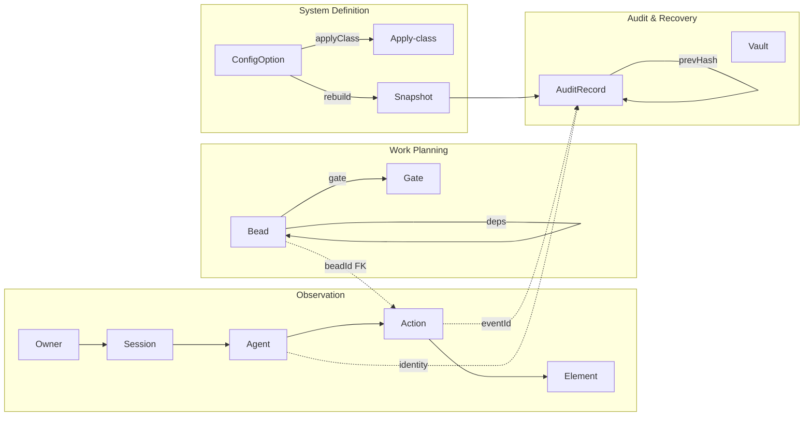

# DDD-001 — Control Plane Domain Model

Status: Draft · Created 2026-07-16 · Realises PRD-001

## Ubiquitous language

The words below are the ones the code, the UI, and this corpus all use. The frozen source is
`app/src/domain/types.ts`.

| Term | Meaning |
|---|---|
| **Owner** | A human, identified by their Entra object id (`entra:{tid}:{oid}`). The stable key for attribution. Name and UPN are descriptive and may change. |
| **Session** | One human's working span. Root of an agent spawn tree. |
| **Agent** | A running unit of the agent layer (orchestrator or a spawned specialist). Carries owner, session, and parent, so lineage is reconstructable. |
| **Element** | A thing acted upon: a file, service, config, model, or vault. |
| **Action** | One recorded thing an agent did to an element at a time, with a status. The atom of the visualiser and the audit trail. |
| **Apply-class** | How a configuration change lands: hot, live, session, or rebuild. The system's core distinction (ADR-002, extended by ADR-008). |
| **Snapshot / restore point** | A bracket around an overhaul: the system definition before, the outcome after, and the healthcheck verdict. |
| **Bead** | A work item in the ledger, with dependencies, a gate, and an owner who asked for it. |
| **Gate** | A condition a bead waits on: human approval, CI, or a PR merge. |
| **Audit record** | An append-only, hash-chained entry. The system of record for what happened. |

## Bounded contexts

Four contexts, each owning its own language and invariants. They meet only at named ids.

- **Observation** owns Owner/Session/Agent/Action/Element. It is read-only in the UI: you watch,
  you do not edit history.
- **Work Planning** owns Beads and Gates. The intent record: what was asked, in what order.
- **System Definition** owns ConfigOptions and the apply-class rules, and produces Snapshots when
  a rebuild runs.
- **Audit & Recovery** owns AuditRecords and Vaults. Append-only; never a rollback target.

## Key invariants

1. **Attribution is by owner id, never name.** Every Action and AuditRecord joins on
   `entra:{tid}:{oid}`.
2. **An Action's identity is unforgeable by the agent.** The owner/session/agent tuple is set by
   the orchestrator at spawn, not by anything the agent can write.
3. **Audit is append-only and outside rollback scope.** Rolling back the system definition never
   rewinds Observation or Audit. A rollback is itself a recorded Action.
4. **A bead is ready only when it has no open blocking dependency.** A gated bead does not proceed
   until its gate clears; the human gate is the overhaul sign-off.
5. **Apply-class is a property of the option, not the moment.** The same toggle is always live, or
   always rebuild; the operator learns it once.

## Aggregates

- **Session** (root) → Agents → Actions. The spawn tree.
- **Overhaul** = ConfigOption(rebuild) changes → Snapshot → healthcheck → cutover/rollback.
- **Bead** (root) with a dependency edge set and a gate.
- **AuditChain** = ordered AuditRecords linked by prevHash, anchored periodically.

## Cross-context joins

- `Action.id` ↔ `AuditRecord.eventId`: the execution record links to the trust record.
- `Bead.id` used as a foreign key on Actions: the intent record links to execution.
- `Owner.id` everywhere: the single attribution key.

These are deliberately narrow. The contexts do not share models; they share ids.
