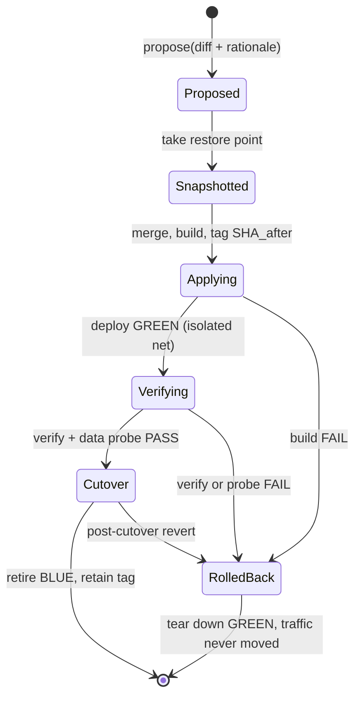

# DDD-002 — Overhaul Lifecycle

Status: Draft · Created 2026-07-16 · Realises PRD-004

## What this models

An overhaul is the domain lifecycle a rebuild-class change runs through: propose → snapshot → apply →
verify → cutover, or auto-rollback on any failure. DDD-001 named the Overhaul aggregate
(ConfigOption(rebuild) changes → Snapshot → healthcheck → cutover/rollback); this document gives it a
state machine, the events it emits, and the one invariant that keeps a rollback safe.

## Ubiquitous language (additions to DDD-001)

| Term | Meaning |
|---|---|
| **Overhaul** | One rebuild-class change set, from proposal to cutover or rollback. The saga. |
| **Restore point** | The bracket taken before apply: git tag of the SHA before, a restic snapshot of user-data and audit, the retained current image tag, and a signed manifest. |
| **Data probe** | A read-only compatibility check run against real user data during verify, before any cutover. |
| **Cutover** | Re-pointing the proxy from the blue stack to the verified green stack. |
| **Manifest verdict** | The recorded outcome on the restore-point manifest: `CUTOVER` or `AUTO_ROLLED_BACK`. |

## State machine

Blue serves throughout Applying and Verifying, so a failure before Cutover is invisible to users.
After Cutover, a revert is re-pointing the proxy at the retained prior tag plus a git revert, which is
why the terminal state can still return to RolledBack in seconds.

## Events emitted

Each transition is an audit SYSTEM_EVENT (corpus/09), and progress reaches the UI over SSE (ADR-005):

| Transition | Event | Payload highlights |
|---|---|---|
| propose | `OVERHAUL_PROPOSED` | git diff, rationale, proposer owner id |
| snapshot | `RESTORE_POINT_CREATED` | SHA_before, restic snapshot ids, image tag, manifest id |
| apply | `OVERHAUL_APPLYING` | SHA_after, build log ref |
| verify | `OVERHAUL_VERIFYING` | healthcheck suite id, data-probe result |
| cutover | `OVERHAUL_CUTOVER` | manifest verdict `CUTOVER`, retired tag |
| rollback | `OVERHAUL_ROLLED_BACK` | manifest verdict `AUTO_ROLLED_BACK`, failure logs |

A rollback is itself a recorded event, never an erasure (DDD-001 invariant 3). The failure logs return
to the agent for re-planning.

## Invariant that makes rollback safe

Audit and user data sit outside rollback scope, enforced by partition and permissions, not convention
(ADR-006, corpus/10):

1. The restore point captures user data and audit, but rollback of the System-Definition plane never
   rewinds them. A user-data restore is a separate, guarded operation that forks to a new volume and
   never overwrites live data.
2. The audit trail has no rollback control at all. The overhaul writes to it; nothing in the overhaul
   can rewind it.
3. The supervisor that performs the rollback lives in the recovery partition, outside the agent's
   writable scope, so a self-modifying overhaul cannot modify its own undo button.

## Aggregates and invariants (link to DDD-001)

- **Overhaul** (root) is the state machine above, one per rebuild-class change set.
- Reuses DDD-001 invariants: attribution by owner id (1); audit append-only and outside rollback (3).
- Adds: no cutover without a passing data probe; no apply without a restore point.

## Traceability

Realises PRD-004. Extends DDD-001 (Overhaul aggregate). Architecture: corpus/10 snapshot-rollback,
ADR-006. Rebuild-class trigger: ADR-002. Events land in the audit trail: PRD-006, corpus/09. Progress
transport: ADR-005.
