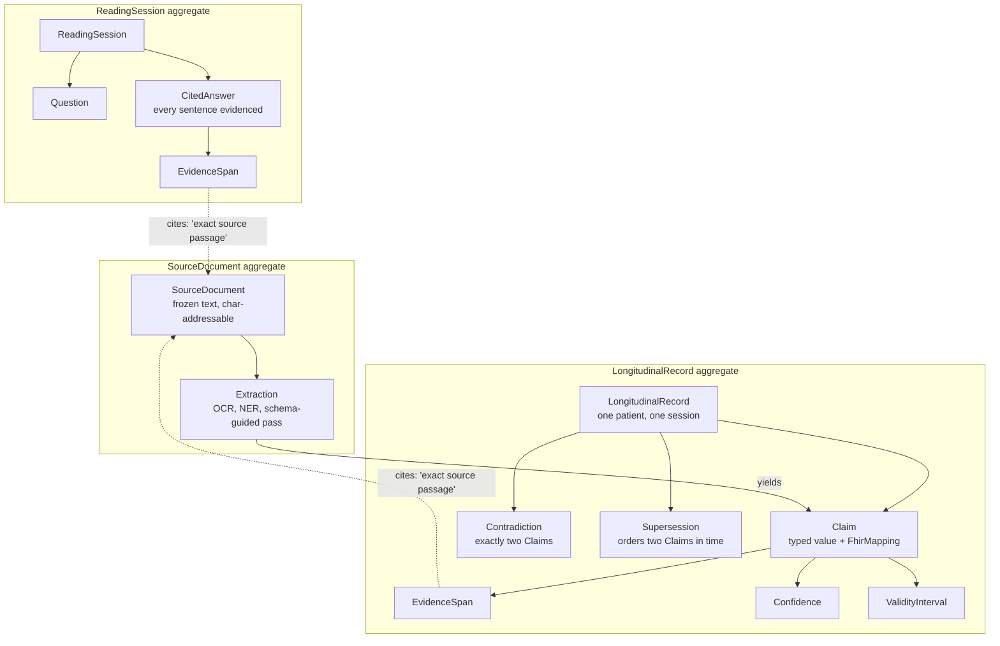
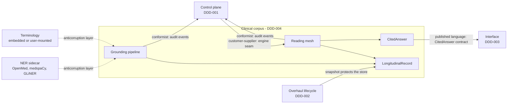

# DDD-004 — Clinical Corpus Domain

Status: Draft · Created 2026-07-17 · Realises PRD-010 and PRD-011 · Extends DDD-001

## What this models

The clinical corpus context is the corpus-intelligence domain for **one patient**: what the system
knows about a single fictional patient's record, how every piece of that knowledge is evidenced,
and how a clinician's question becomes an answer whose every sentence cites its source. It is
distinct from the control plane (DDD-001, who did what), the overhaul lifecycle (DDD-002, how the
system changes itself), and the interface (DDD-003, how things render). The demonstrator brief's
ubiquitous-language table is the binding vocabulary; this document gives those terms their formal
shape — aggregates, entities, value objects, and the invariants that make "no unsourced claim" a
property of the model rather than a policy.

The single-patient boundary is load-bearing. One record nearly fits the agent mesh's working
context, which is why the domain reads by holding slices in context and reconciling on recency and
validity rather than retrieving by vector similarity (ADR-011). Population-scale search and
cross-patient linkage are not deferred features of this context; they belong to a different product
this model deliberately cannot express.

## Ubiquitous language (formal model)

The brief fixes the terms; this table fixes their DDD classification. The three aggregate roots are
**SourceDocument**, **LongitudinalRecord**, and **ReadingSession**.

| Term | Kind | Meaning |
|---|---|---|
| **SourceDocument** | Entity, aggregate root | One ingested artefact (letter, lab report, `.eml`, scanned note) with an id, type, provenance, and OCR/extracted text addressable by character offset. Its text is frozen at ingestion so spans into it never dangle. |
| **Extraction** | Entity (in SourceDocument) | One structuring pass over a document — OCR, NER, or schema-guided LLM extraction — recorded with the tool identity and route (local/cloud) that produced it. |
| **Ingestion / Grounding pipeline** | Domain service | The ingestion-time process that turns a SourceDocument into Claims and folds them into the LongitudinalRecord. Begins where PRD-007's routed OCR ends. |
| **Claim** | Entity (in LongitudinalRecord) | A single typed, evidence-linked assertion derived from a SourceDocument: `{ typed value, FhirMapping, EvidenceSpan, Confidence, ValidityInterval }`. Named "Claim" because it can be contradicted or superseded; that mutability of standing — never of content — is the point. |
| **EvidenceSpan** | Value object | The exact provenance of a Claim: `source_doc_id` + character span + the quoted passage. The citation primitive. |
| **Confidence** | Value object | A score in `[0,1]` plus the method that produced it. Descriptive, never a licence to hide a Claim. |
| **ValidityInterval** | Value object | The temporal window a Claim speaks for: effective-from, optional effective-to, and precision. What supersession is decided on. |
| **FhirMapping** | Value object | The FHIR R4 resource and element a Claim's value normalises to, with coding from embedded permissive vocabularies (dm+d) or a user-supplied terminology mount (ADR-013). |
| **LongitudinalRecord** | Entity, aggregate root | The reconciled, FHIR-shaped view assembled from all Claims across all SourceDocuments over time, for one patient. The consistency boundary for contradiction and supersession. |
| **Contradiction** | Entity (in LongitudinalRecord) | A detected conflict between exactly two Claims (e.g. a discharge medication list against the GP repeat list). A first-class object the mesh surfaces; never silently resolved. |
| **Supersession** | Value object (in LongitudinalRecord) | An immutable temporal ordering of exactly two Claims: one supersedes, one is superseded (e.g. a corrected laboratory result). The superseded Claim remains in the record, marked. |
| **Question** | Value object (in ReadingSession) | A clinician's natural-language query against the LongitudinalRecord, with asker identity and time. |
| **CitedAnswer** | Entity (in ReadingSession) | An answer composed of sentences, each carrying one or more EvidenceSpans to the source passages that support it. A sentence without evidence cannot be part of one. |
| **ReadingSession** | Entity, aggregate root | One Question, the specialist findings that addressed it, and the CitedAnswer that resulted. The query-time unit of work and of audit. |
| **Reading mesh** | Domain service | The bounded set of specialist agents that resolves a Question by reading the record in context and reconciling Claims, coordinated by the Foreman (DDD-001). |
| **Specialist** | Role | One agent in the reading mesh with a defined slice: Medications, Labs & Observations, Diagnoses & Problems, Chronology, Correspondence. A control-plane Agent playing a corpus-domain role. |

`ReadingSession` and `FhirMapping` are additions this document makes to the brief's table; they
name what the brief already describes (the Question-to-CitedAnswer unit, the FHIR mapping field on
a Claim) without renaming anything.

## Aggregates

- **SourceDocument** (root) owns its Extractions. Once ingested, the document's text is immutable:
  re-running OCR or extraction produces a new document version with new spans, never an edit to the
  old one. This is what keeps every EvidenceSpan resolvable forever.
- **LongitudinalRecord** (root) owns the reconciled Claims and the Contradictions and Supersessions
  among them. It is the consistency boundary: a conflict or a temporal ordering is only meaningful
  between Claims inside the same record, so detection and reconciliation are operations on this
  aggregate and no other. Claims reference SourceDocuments by id and span only — the aggregates
  share ids, not models, matching the house rule from DDD-001.
- **ReadingSession** (root) owns one Question and its CitedAnswer, plus the per-specialist findings
  that produced it. It is the unit the audit trail records at query time: who asked, what was read,
  what was answered, and on what evidence.

## Domain services and read models

The two processes of the brief are domain services, not aggregates — they have behaviour and no
identity worth persisting beyond their events:

- The **grounding pipeline** (ingestion time) is the only writer of Claims. It translates the NER
  sidecar's output (ADR-012) into Extractions and Claims behind an anticorruption layer, so nothing
  downstream depends on spaCy or OpenMed shapes.
- The **reading mesh** (query time) is read-only over the record. Specialists hold their slices in
  context, cross-check one another, and reconcile on recency and validity — never on similarity.

The deterministic tools — the SQLite FTS5 lexical index, the per-document hierarchical tree, and
the typed entity graph (ADR-014) — are **read models**: projections built from the aggregates for
the mesh to find and cite exact passages. No truth lives only in a projection; every one is
disposable and rebuildable from the SourceDocuments and the LongitudinalRecord.

## Invariants

1. **No Claim without evidence.** A Claim cannot be constructed without at least one EvidenceSpan.
   Enforced at the type level, not by convention: there is no unsourced-claim state to reach.
2. **Evidence is verifiable and stable.** An EvidenceSpan's quoted passage must equal the
   characters at its span in the referenced SourceDocument, whose text is frozen at ingestion. A
   citation is therefore checkable by anyone, mechanically.
3. **Every CitedAnswer sentence resolves to evidence.** A sentence with no EvidenceSpan is not
   emitted; the answer says instead that the record does not contain it. This is the affordance
   against overclaiming that the clinician audience is watching for.
4. **A Contradiction is surfaced, never silently resolved.** It references exactly two conflicting
   Claims; detecting it edits neither. Resolution, if any, is a human act outside this context.
5. **Supersession orders, it does not erase.** Exactly two Claims, one superseding and one
   superseded; the superseded Claim stays in the record, marked. History is readable, not rewritten.
6. **One record, one patient, one session.** Contradiction and supersession are defined only within
   a single LongitudinalRecord; cross-patient linkage is inexpressible in this model by construction.
7. **Query time is read-only.** Only the grounding pipeline writes Claims. A Question never mutates
   the corpus; a ReadingSession accumulates findings and an answer, nothing else.
8. **The corpus never writes outward.** No write-back to any care system exists in the model. The
   context's only outbound artefacts are CitedAnswers to the interface and events to the audit trail.

## Domain events

Every event below crosses the boundary into the control plane's audit context as an attributable,
chain-verifiable audit record (PRD-006, DDD-001 invariants 1–3). The owner/session/agent identity
on each is set by the orchestrator at spawn, never by the pipeline or mesh that emits it.

| Event | Emitted when | Payload highlights |
|---|---|---|
| `DocumentIngested` | A SourceDocument's text is frozen and its Extractions complete | doc id, type, provenance, OCR route (local/cloud), extraction tool ids |
| `ClaimExtracted` | A Claim is folded into the LongitudinalRecord | claim id, typed value, FhirMapping, EvidenceSpan, Confidence, ValidityInterval |
| `ContradictionDetected` | Reconciliation finds two Claims in conflict | both claim ids, both EvidenceSpans, conflict kind |
| `ClaimSuperseded` | Reconciliation orders one Claim over another in time | superseding and superseded claim ids, both ValidityIntervals |
| `QuestionAsked` | A clinician submits a Question | session id, question text, asker owner id |
| `AnswerCited` | A CitedAnswer is emitted | session id, sentence count, cited span refs, specialists convened |

`ContradictionDetected` and `ClaimSuperseded` are the reconciliation events the seeded corpus
(PRD-009) exists to trigger: the demonstrator's central scene is these appearing in the audit trail
and on the surface, not being smoothed away.

## Context map

- **Control plane (DDD-001) — upstream, two joins.** For audit, the control plane's Audit &
  Recovery context is an open host service with a published language (the hash-chained, attributed
  audit record); the corpus is a **conformist** — it emits every domain event in that language and
  has no say over the schema. For execution, the relationship is **customer–supplier**: the corpus
  defines the specialist roles, and the control plane supplies the engine seam (PRD-003), the spawn
  tree, and the unforgeable owner/session/agent identity. A Specialist is a DDD-001 Agent playing a
  corpus role; its Actions land in Observation as usual.
- **Overhaul lifecycle (DDD-002) — the corpus store is protected data.** The FHIR record, the FTS5
  index, the document trees, and the entity graph sit in the data plane. Restore points bracket
  them; rollback of the system definition never rewinds them (DDD-002 invariant 1). The corpus is a
  downstream **customer** of the snapshot bracket and models none of it.
- **Interface (DDD-003) — published language: the CitedAnswer contract.** The clinician query
  surface is a panel registered through the typed panel registry (ADR-009, ADR-010). It renders
  CitedAnswers and resolves EvidenceSpans back to source passages for click-through; it never
  reaches into the aggregates. The corpus is upstream **supplier**; the CitedAnswer schema is the
  shared, published contract.
- **External systems — anticorruption layers.** The Python NER sidecar (ADR-012) and the
  user-supplied terminology mount (ADR-013) sit outside the boundary. The grounding pipeline
  translates both: extraction output becomes Extractions and Claims, and mounted SNOMED/UMLS
  releases are consulted through a translation layer, so the domain model depends on no external
  terminology's shape. On the permissive floor dm+d is the only embedded vocabulary; on `doctorBox` a
  richer terminology (SNOMED/UMLS/ICD-10) may be embedded on the box or mounted (ADR-013). Either
  way it is an audited, operator-owned configuration event in the System-Definition context,
  mirroring the local/cloud switch.

## What this is not

This context owns what is known about the patient and how it is evidenced. It does not own who did
the knowing (DDD-001), how the system that does it is rebuilt (DDD-002), or how the answer is drawn
on screen (DDD-003). And per the brief: it is not a clinical record system, it makes no diagnostic
or treatment claim, and it holds no real person's data — one fabricated patient, synthetic sources,
honest framing.

## Traceability

- Binding vocabulary and scope: [demonstrator brief](../../demonstrator-brief.md) — its
  ubiquitous-language table is elaborated here, not altered.
- Realises [PRD-010 — clinical grounding pipeline](../prd/PRD-010-clinical-grounding-pipeline.md)
  (ingestion side) and
  [PRD-011 — clinician query and reading mesh](../prd/PRD-011-clinician-query-and-reading-mesh.md)
  (query side).
- Retrieval stance and token-economics boundary:
  [ADR-011 — context-native retrieval](../adr/ADR-011-context-native-retrieval.md).
- Claim model, FHIR representation, terminology mount:
  [ADR-013 — FHIR record and terminology mount](../adr/ADR-013-fhir-record-and-terminology-mount.md).
- Context-map counterparts: [DDD-001 — control plane](./DDD-001-control-plane-domain.md),
  [DDD-002 — overhaul lifecycle](./DDD-002-overhaul-lifecycle.md),
  [DDD-003 — interface domain](./DDD-003-interface-domain.md).
- Audit events land per PRD-006; the engine seam is PRD-003; ingestion begins where PRD-007's
  routed OCR ends.
