# PRD-000 — Product Shape and Roadmap

Status: Living scaffold · Created 2026-07-16

This is the map of what the product is and the order we expect to build it. It sits above the
per-surface PRDs and points at the research corpus that justifies each choice. Treat the future
milestones as scaffolding: shaped enough to plan against, not yet specified.

**Branches (2026-07-17).** `doctorBox` now carries a defined application — a showcase for NHS clinicians
(the [demonstrator brief](../../demonstrator-brief.md), and PRD-008–011, ADR-011–014, DDD-004).
`main` keeps the generic sandbox described here as a reusable baseline. The product shape and the
spine below are common to both; the demonstrator is an application built on the spine, not a fork of
it.

## What we are building

A self-contained dev sandbox for a client team. A primary user sees a chat bubble in their own
dashboard and hands the agent problems bigger than their interface. An admin runs the box through
**Foreman**, the control plane. The agent layer does CTO-scale overhauls of the sandbox itself,
bracketed by snapshots and rollback. Everything in the default box is permissively licensed, with
one deliberate exception: the optional browser-sidecar module ships Google Chrome (proprietary) for
a structurally undetectable agent browser (an operator-level decision — see `docker/Dockerfile.browser`).

Two governing rules, from the client steers:

- **A distillation, not agentbox.** Plain container, few moving parts, TOML-gated bundles. If a
  client needs the maximalist machine, sell them agentbox.
- **Maintainability outranks capability.** Fewest tools, one per job, narrow interfaces we own.

These rules take architectural shape as a **slim core with surfaces and modules around it**
([ADR-009](../adr/ADR-009-slim-core-surfaces-as-modules.md)). The core is the governance and data
spine; every other capability is a surface or a module that plugs in through config and a compose
profile. Each open question below then resolves to "add or drop a module", not a core rewrite.

## Milestones

```mermaid
flowchart LR
  M1[M1 Control plane UI\nmock-backed] --> M2[M2 Backend + real data\nHono + adapters]
  M2 --> M3[M3 Agent engine\npi embed + hooks]
  M3 --> M4[M4 Container + rebuild\nsnapshot/rollback]
  M4 --> M5[M5 Identity + tunnels\nEntra + Cloudflare]
  M5 --> M6[M6 Audit + vaults\nwrite-only + gocryptfs]
  M6 --> M7[M7 Chat bubble\nembed in client dashboard]
  classDef done fill:#0e2b28,stroke:#33c2b4;
  classDef active fill:#2b2410,stroke:#f0a53a;
  class M1 done;
  class M2 done;
  class M3,M4,M5,M6 active;
```

Status legend: **Done** shipped and judged · **In progress** being specified or built now ·
**Planned** scoped, not yet started.

| Milestone | Delivers | Status | Basis |
|---|---|---|---|
| **M1** | Foreman UI, mock-backed, judged before containerising | Done | PRD-001, ADR-001/002/003 |
| **M2** | Hono control-plane server; adapter swaps mock for HTTP/SSE | Done | PRD-002, ADR-004/005, corpus/11 |
| **M3** | pi embedded via RPC/SDK; audit + identity injection through its hooks | In progress | PRD-003, corpus/12 |
| **M4** | Multi-stage Dockerfile; three-planes snapshot/rollback; blue/green | In progress | PRD-004, ADR-006, DDD-002, corpus/10, corpus/13 |
| **M5** | Entra SSO via oauth2-proxy; cloudflared + Access; loopback-only | In progress | PRD-005, corpus/05, corpus/06 |
| **M6** | Write-only audit sidecar; hash chain + anchors; gocryptfs vaults | In progress | PRD-006, corpus/09, corpus/05 |
| **M7** | deep-chat bubble in the client dashboard → pi over the control plane | Planned | corpus/11 |

M3–M6 are in progress: their seams are built and tested (`server/src/engine/`, `server/src/audit/`)
or their container definitions written and compose-validated; what remains is host-runtime wiring —
a live `pi` process, real Entra/OIDC and tunnel secrets, and the image builds. M7 is not started:
the client dashboard is unseen.

## Defined application on `doctorBox`: the clinician demonstrator

`doctorBox` aims the spine at a first real use case: a showcase for NHS doctors of what an agent harness
can do with a patient's records. One synthetic patient's mixed-format documents ingest through the
existing routed OCR, an agent layer grounds them into a typed, evidence-linked record, and a bounded
mesh of specialist agents answers a clinician's questions with sentence-level citations. It is a
demonstrator — not for clinical use, on wholly synthetic data — and the honest framing is
[PRD-008](./PRD-008-clinician-demonstrator.md)'s.

The demonstrator is additive: it consumes the M1–M6 spine (audit, identity, egress proof, OCR
routing, panels, the engine seam) and adds capabilities, each with its own record.

| Document | Adds |
|---|---|
| [PRD-008](./PRD-008-clinician-demonstrator.md) | The demonstrator: audience, guided narrative, framing |
| [PRD-009](./PRD-009-synthetic-patient-corpus.md) | The synthetic one-patient corpus, with seeded contradictions |
| [PRD-010](./PRD-010-clinical-grounding-pipeline.md) | Ingestion: OCR → NER → Claims → LongitudinalRecord |
| [PRD-011](./PRD-011-clinician-query-and-reading-mesh.md) | The specialist reading mesh and cited answers |
| [ADR-011](../adr/ADR-011-context-native-retrieval.md) | Reject the vector-RAG backbone; read the record in context |
| [ADR-012](../adr/ADR-012-clinical-grounding-stack.md) | OpenMed + medspaCy grounding stack (permissive) |
| [ADR-013](../adr/ADR-013-fhir-record-and-terminology-mount.md) | FHIR record; dm+d floor with a user mount, and (on `doctorBox`) SNOMED/UMLS embedded on the box |
| [ADR-014](../adr/ADR-014-corpus-store-lexical-index-and-graph.md) | SQLite FTS5 store; typed, non-embedded entity graph |
| [ADR-015](../adr/ADR-015-target-platform-dgx-spark.md) | Target platform: NVIDIA DGX Spark (128 GB unified, ARM64, FP4) |
| [DDD-004](../ddd/DDD-004-clinical-corpus-domain.md) | The clinical corpus bounded context |

The organising choice is that retrieval is context-native: for one patient the record nearly fits
the mesh's context, so the design reads and reconciles on recency and validity rather than embedding
similarity ([ADR-011](../adr/ADR-011-context-native-retrieval.md)). Two `doctorBox`-only choices set the
demo's ceiling: the permissive-only rule is relaxed for this non-distributed one-shot showcase, so
it may use restrictively-licensed terminology (SNOMED/UMLS) and models on the box — never in this
public repo; and it targets an NVIDIA DGX Spark, whose 128 GB of unified memory lets the whole local
stack co-reside ([ADR-015](../adr/ADR-015-target-platform-dgx-spark.md)).

The first vertical slice is built and tested, offline-first in the codebase's mock-first shape: the
synthetic patient corpus with seeded contradictions (`app/src/data/corpus.ts`), the grounding and
reading-mesh seams with deterministic defaults and injectable live paths (`server/src/corpus/`), the
Clinician tab (`app/src/features/clinician/`), the corpus routes and their audit events, and the NER
sidecar with a working offline rules mode (`sidecars/ner/`). What remains is host-runtime wiring:
aarch64 image builds, model downloads for the models mode, and a live `pi`.

## Feature areas and their homes

| Area | Surface | Status |
|---|---|---|
| System overview | Foreman F1 | M1 built |
| Action visualiser | Foreman F2 | M1 built |
| Activity + agent tree | Foreman F3 | M1 built |
| Work ledger (beads) | Foreman F4 | M1 built (UI); engine M3 |
| Configuration + apply-class | Foreman F5 | M1 built (UI); rebuild engine M4 |
| Snapshots, audit, vaults | Foreman F6 | M1 built (UI); real M4/M6 |
| Documents + OCR routing | Foreman F7 | M2 built (UI + server); OCR M6, PRD-007 |
| Core/surfaces/modules manifest | Foreman F8 (System) | Built; ADR-009 |
| Agent engine | embedded pi | M3 |
| Chat bubble | client dashboard | M7 |

The tab list is nine (Overview, Visualiser, Activity, Work, Documents, Clinician, Configuration,
Operations, System); App.tsx and the README are canonical for the current set.

## What we deliberately defer

- Kubernetes or multi-host deployment. Single-host compose for the pilot.
- Multi-tenant isolation beyond per-project vaults, pending the client brief.
- The primary-user chat UX polish, until the sandbox underneath is solid.

## Open questions carried to the client brief

See `docs/client-questions.md`. The five that most change the build: where it runs, one shared
box vs per-user, the concrete "meta app kit", which providers survive procurement, and who may
trigger an overhaul.
