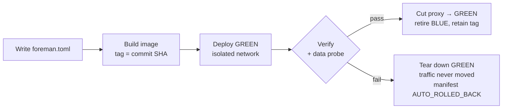

# PRD-004 — Container and Rebuild

Status: Draft · Owner: DreamLab · Created 2026-07-16 · Realises PRD-000 (M4) · Supersedes: none

## Summary

The sandbox ships as one plain multi-stage image whose optional toolchain bundles are gated by
single TOML keys, and it changes itself through a blue/green rebuild bracketed by a snapshot and
protected by auto-rollback. The thing that performs a rollback lives in a recovery partition outside
the agent's reach. Rebuilds run on a real host or in CI, not inside this dev environment, where
Docker-in-Docker bind mounts do not resolve to the source being edited.

If you remember one thing: **a rebuild is a GitOps image swap with a data probe and a retained prior
tag**, so undoing it is re-pointing a proxy, not rebuilding.

## Problem

Configuration changes of the heavy class (toolchain bundles, embedded model, agent engine) rewrite
the system definition and need a new image. A self-modifying box must do that safely: snapshot
before, verify after, cut over without downtime, and undo on failure without touching user data or
the audit trail. corpus/10 fixed the architecture; corpus/13 fixed what goes in the image.

## Goals

1. One multi-stage Dockerfile with digest-pinned bases and at most three optional toolchain
   bundles, each a stage keyed to one TOML flag (corpus/13).
2. A rebuild pipeline: write TOML → build → tag by commit SHA → deploy the green stack on an
   isolated network while blue keeps serving → verify → cut over or tear down.
3. A read-only data-compatibility probe in the verify step, run against real user data before any
   cutover.
4. Auto-rollback for free from blue/green: failure means the proxy never moves; post-cutover
   rollback re-points at the retained prior tag.
5. A supervisor in a recovery partition: separately versioned, outside the agent's writable scope,
   human-gated to upgrade.

## Non-goals

- The snapshot store's component choices (ADR-006 covers git + registry + restic).
- Dynamic package installation inside a running container. Disabling a bundle removes its layer;
  nothing is installed at runtime, which is the snapshot system's enemy (corpus/13).
- Kubernetes or multi-host orchestration. Single-host compose for the pilot (PRD-000).

## Image contents

Three TOML-gated bundles over a debian-slim + Node 24 base, about 2.1 GB by default (corpus/13):

| Bundle | Gate | Contents |
|---|---|---|
| TS dashboard | `ts_dashboard` | Node 24 + pnpm, Vite, Vitest, Biome, Playwright |
| Python + Jupyter | `python` | uv-managed interpreters, ruff, pytest, JupyterLab, papermill |
| Typesetting | `typesetting` | Typst default; Tectonic for LaTeX; texlive-full only as an air-gap profile |

Eleven baked binaries in total; libraries live in project dependency files, never in the image. Each
quarterly update bumps digests in one place.

## Rebuild pipeline

Blue keeps serving throughout, so a failed rebuild is invisible to users and a passed one is a
zero-downtime cutover. The retained prior tag plus a git revert makes post-cutover rollback a
seconds-long operation, no rebuild.

## Build environment note

Rebuilds run on a real host or in CI. This dev environment mounts the Docker socket, but its
bind-mount paths resolve on the host filesystem, not the container's, so a build launched from
inside it bakes in image code rather than the current source edits. The rebuild pipeline is
therefore specified and tested against a host or CI runner, not this box.

## Success criteria

- Toggling a bundle flag and rebuilding adds or removes exactly that layer, nothing else.
- A failed healthcheck or data probe leaves blue serving and records an AUTO_ROLLED_BACK manifest.
- A post-cutover rollback restores the prior image tag and definition in seconds without a rebuild.
- The agent has no write path to the supervisor, the recovery partition, or the retained prior tags.
- A default image is about 2.1 GB; the full-latex profile is opt-in only.

## Open questions (for the client brief)

- How many prior image tags and restic snapshots to retain before cold-archiving?
- Is an air-gapped install in scope (all components local, full-latex profile)?
- Who may trigger a rebuild: admin only, or a gated agent proposal?

## Traceability

Realises PRD-000 (M4). Snapshot and rollback architecture: corpus/10, ADR-006. Image bundles:
corpus/13 dev-toolchain-loadout. Rebuild is the heavy apply-class from ADR-002. Overhaul lifecycle
as a domain saga: DDD-002. Config file: ADR-004, PRD-002.
