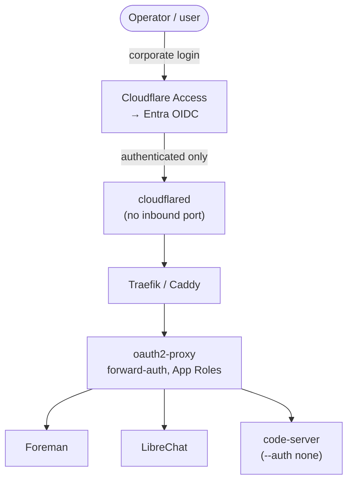

# PRD-005 — Identity and Network Exposure

Status: Draft · Owner: DreamLab · Created 2026-07-16 · Realises PRD-000 (M5) · Supersedes: none

## Summary

Access to the sandbox is gated by corporate SSO through Microsoft Entra ID, enforced by oauth2-proxy
in front of the stack, with authorisation by Entra App Roles rather than group claims. The box is
reachable through a cloudflared tunnel behind Cloudflare Access (posture a), and it binds only to
loopback on the host, so there is no inbound port to attack. corpus/05 and corpus/06 fixed the
components.

If you remember one thing: **nothing on the box listens on a public interface.** Cloudflare Access
does edge auth, and oauth2-proxy does it again inside for defence-in-depth and local role mapping.

## Problem

A client's operators and users sign in with their corporate Microsoft accounts, and the box must
respect that without opening a port to the internet or inventing its own user store. Three things
need deciding: how identity is proven (Entra), how it is enforced in front of services that have no
OIDC of their own, and how the box is exposed without inbound ports.

## Goals

1. Entra ID SSO for every human surface, using one App Registration, single-tenant.
2. Authorisation by App Roles (`Sandbox.Admin`, `Sandbox.User`), not raw group claims, because group
   GUIDs are tenant-specific and overage past 200 memberships drops the claim (corpus/05).
3. oauth2-proxy (MIT) as forward-auth in front of Traefik or Caddy, protecting services with no
   built-in OIDC (code-server runs `--auth none` behind it).
4. cloudflared + Cloudflare Access → Entra OIDC as the default exposure posture, group-object-ID
   policies at the edge, Free tier up to 50 users.
5. Loopback-only host binding: the tunnel is the only path in; no service publishes a host port.

## Non-goals

- The two heavier postures beyond (a). Posture (b) Microsoft-everything and (c) self-host-everything
  (OpenZiti) are documented in corpus/06 and chosen at procurement, not built by default.
- The internal session JWT and the identity seed into audit (PRD-006). This PRD gets the user proven
  and role-gated; that one carries the identity into the trail.
- Device-posture and Conditional Access policy authoring, which live in the client's tenant, not our
  image.

## Architecture

Two auth checks are deliberate: Cloudflare Access rejects unauthenticated traffic at the edge so the
origin never sees it, and oauth2-proxy re-validates inside the stack and maps the Entra App Role to a
local admin or user decision. In posture (c), oauth2-proxy is the only auth layer.

## Entra practicalities

- One App Registration, multiple redirect URIs, single-tenant. Client secrets expire (max 24
  months); rotation is an operational task surfaced in the config plane.
- Managed tenants often omit the `email` claim by default; add it as an optional claim on the ID
  token or SSO breaks silently.
- App Roles assigned to groups are not emitted for service principals; service-to-service callers
  need direct assignment.

## Success criteria

- Every human surface requires an Entra login; an unauthenticated request never reaches the origin.
- An operator with `Sandbox.Admin` sees the admin plane; a `Sandbox.User` does not.
- No service binds a public host port; the cloudflared tunnel is the sole ingress.
- Rotating the client secret is a config-plane task with a visible expiry, not a code change.
- code-server is reachable only through oauth2-proxy, never on its shared-password auth.

## Open questions (for the client brief)

- Which exposure posture (a/b/c) does the client's security team mandate?
- Is Cloudflare acceptable, or is a self-hosted tunnel (OpenZiti) required?
- SCIM group sync needs Entra P1/P2: is that licensing available?

## Traceability

Realises PRD-000 (M5). SSO components: corpus/05 entra-sso. Tunnel postures: corpus/06
secure-tunnels. Identity carried into audit: PRD-006, corpus/09. Provisioned through the config
plane: PRD-001 (F5), PRD-002.
