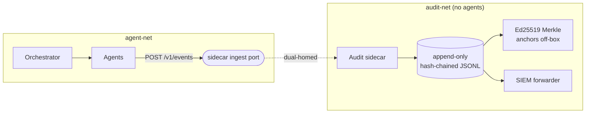

# PRD-006 — Audit and Vaults

Status: Draft · Owner: DreamLab · Created 2026-07-16 · Realises PRD-000 (M6) · Supersedes: none

## Summary

Two trust mechanisms sit under the sandbox: a write-only audit sidecar that records what every agent
did and who asked, and per-project gocryptfs vaults that keep project data encrypted at rest and
decrypt only on an authenticated unlock. Both are proportionate to a dev sandbox: detect tampering
cheaply and provably, keep the smallest privileged surface. corpus/09 and corpus/05 fixed the
designs.

If you remember one thing: **the audit trail answers "what did the agent change and who asked for
it?" months later, and it sits outside every rollback and every vault**, so nothing the agent does
can rewrite it.

## Problem

A self-modifying agent box needs a record an operator trusts long after the fact, and a way to hold
client project data that is safe on a stolen disk or a leaked backup. Both must resist the agent
itself: the agent must not be able to forge its identity in the record, read the trail back as a
prompt-injection surface, or reach the keys.

## Goals

1. A write-only audit sidecar whose write-only property is topological, not a promise in code: two
   Docker networks, with no read handler bound on the agent-facing interface (corpus/09).
2. Hash-chained JSONL records (`hash = SHA256(prev_hash ‖ canonical_json(record))`) with hourly
   Ed25519-signed Merkle-root anchors shipped off-box, so a retroactive edit breaks the chain and
   fails the external anchor.
3. Unforgeable identity: the canonical `entra:{tid}:{oid}` seed, carried as a ULID hierarchy (user →
   session → agent → action) with a materialised lineage, set by the orchestrator at spawn through
   the engine's hooks (PRD-003).
4. Per-project gocryptfs (MIT) vaults, v1 decrypt-on-unlock: zero FUSE, zero SYS_ADMIN, keys wrapped
   in Azure Key Vault and released on an Entra session.
5. Honest threat-model copy in the UI: say plainly what encryption protects and what it does not.

## Non-goals

- Full insider prevention. v1 detects tampering (separation of uids, append-only inode, off-box
  anchors); WORM, S3 Object Lock, and four-eyes are v2 (corpus/09).
- The live FUSE sidecar (vault v2). v1 decrypt-on-unlock is the default; v2 is Linux-only and carries
  the mount-propagation gotchas (corpus/05).
- Replacing container isolation. Vaults protect data at rest, not a running container; that is what
  PRD-004 and PRD-005 are for.

## Audit topology

The sidecar is dual-homed but binds no query handler on agent-net, so the agent has a write path and
no read path. The active segment gets an append-only inode (`chattr +a`): a compromised sidecar can
append but not rewrite. A rollback is a recorded SYSTEM_EVENT, never an erasure (DDD-001, DDD-002).

## Vault unlock

An Entra session releases the key: the control plane calls Azure Key Vault to unwrap the project DEK
(the HSM key never leaves), an unlock job decrypts the gocryptfs cipherdir to a plain volume, the dev
container mounts it with no FUSE and no SYS_ADMIN, and on lock or session end the changed blocks are
re-encrypted and the plaintext and DEK are shredded. Unlock and lock are SYSTEM_EVENTs in the audit
trail. Cipherdirs are per-4KB-block AES-256-GCM, so unchanged blocks keep identical ciphertext and
the vault is restic-delta-friendly and safe to sync while locked.

## What the vault does and does not protect (UI copy)

Protects: a stolen or lost disk, a leaked backup, storage-provider snooping, key-less host read.
Does not protect once someone is inside the running container: host root, docker-socket access,
in-container malware, a compromised Entra session, RAM forensics of the DEK. One line for the client:
"protects data sitting still or in a backup someone shouldn't have; does nothing once someone is
inside the running container."

## Success criteria

- The agent network has an ingest port and no readable audit endpoint; a read attempt from an agent
  fails at the wiring.
- The `audit-verify` CLI recomputes the chain and reports the last off-box anchor.
- Every action carries the full `entra:{tid}:{oid}` → session → agent → action tuple, unforgeable
  from inside the agent.
- A locked vault is unreadable without an Entra-gated unlock; unlock and lock both appear in the trail.
- The UI states the vault threat model in plain words, not marketing.

## Open questions (for the client brief)

- SIEM target and export format (CEF over syslog is the safe default)?
- Azure Key Vault in the client tenant, or OpenBao for a non-Azure client?
- Audit retention and cold-archive tiering before the volume grows unbounded?

## Traceability

Realises PRD-000 (M6). Audit and identity architecture: corpus/09 audit-architecture,
agent-observability. Vaults: corpus/05 encrypted-vaults. Identity injection point: PRD-003,
corpus/12. Audit-outside-rollback invariant: DDD-001, DDD-002, ADR-006. Vault as the User-Data plane:
ADR-006.
