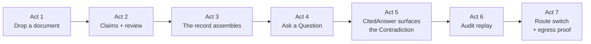

# PRD-008 — Clinician Demonstrator

Status: Draft · Owner: DreamLab · Created 2026-07-17 · Realises PRD-000 (`doctorBox` demonstrator pivot) · Supersedes: none

## Summary

One fictional patient's records — referral and clinic letters, discharge summaries, lab reports, a
repeat-medication list, GP notes, an e-consult email, a few scanned handwritten pages — arrive in
the sandbox the way real care produces them. The box reads them, grounds them into a typed,
evidence-linked LongitudinalRecord, and lets a clinician ask Questions whose answers cite the exact
source passage behind every sentence. An operator shows the same session from Foreman: who did
what, which route each document took, and proof that nothing left the box.

If you remember one thing: **the demonstrator earns a sceptical clinical audience's trust by
showing its working — attribution, audit, egress proof, and surfaced Contradictions — and by
stating plainly what it is not**, rather than performing an accuracy nobody can promise.

The demonstrator brief ([../../demonstrator-brief.md](../../demonstrator-brief.md)) is the binding
ground truth for this pivot; this PRD gives it product shape. The corpus, the ingestion pipeline,
and the query mesh each have their own PRD ([PRD-009](./PRD-009-synthetic-patient-corpus.md),
[PRD-010](./PRD-010-clinical-grounding-pipeline.md),
[PRD-011](./PRD-011-clinician-query-and-reading-mesh.md)); this document owns the audience, the
narrative, and the framing.

## Problem

NHS doctors in 2026 are being taught to be wary of AI that overclaims. National ambient-scribe
guidance requires a clinician to review and approve every AI output; professional bodies remind
them that liability for the record stays with the clinician; hallucination and silent data egress
are the two failure modes every training session names. A chatbot demo that answers fluently and
hides its provenance teaches this audience nothing — worse, it confirms the suspicion.

What does not exist is a demonstrator that shows the affordances a trustworthy system would need —
per-output attribution, a verifiable audit trail, a provable local/cloud data boundary, and
conflicts surfaced instead of smoothed over — on material realistic enough to be judged. docBox has
the governance spine (audit hash chain, identity attribution, per-feature routing, egress proof,
snapshots); it lacks a defined audience and a story that puts the spine to work.

## Goals

1. Run a guided narrative, end to end in one session, from dropping a SourceDocument to a
   CitedAnswer that surfaces a seeded Contradiction.
2. Teach five affordances by showing them, not describing them: harness/orchestration, per-output
   attribution, the audit trail, local-versus-cloud egress, and contradiction surfacing.
3. Hold the single-patient scope: one session, one LongitudinalRecord, the whole record near
   context-sized.
4. State what the demonstrator is not — in the interface and in the script, not only in documents.
5. Run entirely on the existing spine (PRD-005 egress proof, PRD-006 audit, PRD-007 OCR routing,
   the ADR-009/ADR-010 panel system, the PRD-003 engine seam) with no re-architecture.

## Non-goals

- Clinical use. No diagnostic or treatment claim; not a medical device.
- Real data. One fabricated patient; no living identifiable person, so no personal data.
- An EPR. The box ingests documents to reason over them; it writes back to no care system.
- Population-scale search, cross-patient linkage, or multi-tenant retrieval — a different product
  that would need the very index this design rejects (ADR-011).
- The corpus recipe (PRD-009), the pipeline mechanics (PRD-010), and the mesh mechanics (PRD-011).
  This PRD consumes them.

## Users and jobs

| User | Job this does |
|---|---|
| Presenter / operator | Run the narrative, flip the route switch, open the audit trail live |
| NHS clinician (audience) | Judge whether the affordances shown would survive real practice |
| Reviewer / commissioner | Check the governance framing and the licence posture hold up |

## The guided narrative

Seven acts, in order. Each act exists to show one thing; the demo fails if an act's point can be
mistaken for decoration.

1. **Drop a document.** The presenter uploads one discharge summary. It lands on the user-data
   plane, OCR routed `local` (PRD-007). The egress record shows no request left the box (PRD-005).
2. **Watch it become Claims.** The grounding pipeline (PRD-010) turns the page into Claims, each
   with an EvidenceSpan and a confidence score. One low-confidence field sits in the review queue;
   a person clears it. The system is seen asking for help rather than guessing.
3. **Ground the corpus.** The rest of the patient's documents (PRD-009) ingest. The
   LongitudinalRecord assembles; the timeline fills; the handwritten drug chart visibly costs more
   review than the typed letters — the honest OCR limits of PRD-007, on stage.
4. **Ask a Question.** "What is this patient taking, and since when?" The Reading mesh convenes
   (PRD-011): the Specialists appear in the activity tree, each reading its slice, cross-checking
   the others. Orchestration is watched, not asserted.
5. **The answer shows its working.** The CitedAnswer arrives. Each sentence expands to its
   highlighted source passage. One sentence surfaces the seeded Contradiction: the discharge
   medication list disagrees with the GP repeat list. The mesh names both sources with their dates
   rather than silently picking one. This is the moment the demo is built around.
6. **Follow the audit.** The audit trail replays the session: upload, every extraction, the
   Question, the answer — each an attributable, chain-verifiable event (PRD-006).
7. **Flip the switch.** The presenter re-routes OCR to a cloud provider for a low-sensitivity
   document and shows the egress record change. The local/cloud choice is per feature, per
   project, live, and provable — residency as an operator decision, not a slogan.

## What it teaches

| Affordance | Where the script shows it | Why this audience cares |
|---|---|---|
| Harness / orchestration | Act 4 — Specialists visible in the activity tree | Mirrors MDT reasoning; shows the machine is organised, not oracular |
| Per-output attribution | Act 5 — every sentence expands to its EvidenceSpan | Guidance requires clinician review; review needs sources |
| Audit trail | Act 6 — chain-verifiable replay | The hazard-log discipline a regulated system would need |
| Local vs cloud egress | Acts 1 and 7 — egress record before and after the switch | "Does my data leave the box" is the first question asked |
| Contradiction surfacing | Act 5 — both sources named, neither silently chosen | Real records conflict; a system that hides that is dangerous |

## Scope boundary: single-patient context

The demonstrator operates on one patient's context at a time. One patient's record is small enough
to sit inside the Reading mesh's working context, and the whole retrieval design (ADR-011) rests
on that fact. Population-scale search and cross-patient linkage are out of scope — not deferred
polish but a different product. One session, one LongitudinalRecord. This keeps the build inside
the maintainability-outranks-capability rule ([PRD-000](./PRD-000-product-shape.md)).

## What it is not

Stated up front, in the interface and the script, because the audience will ask:

- **Not for clinical use.** No diagnostic or treatment claim; not a medical device.
- **Not real data.** One fabricated patient built from permissively licensed synthetic sources.
- **Not a clinical record system.** It reasons over documents; it is not an EPR and writes back to
  nothing.

The governance frameworks a clinical audience expects — UK GDPR/DPIA, DTAC, DCB0129/0160,
UKCA/MDR, DSPT — do not fire for a synthetic showcase, and the brief's governance table states
precisely why each does not, alongside the affordance the architecture shows anyway. Naming that
is more credible than silence; the demo script should say it once, plainly, and move on.

## Stated limits (say them in the script)

Three limits the presenter states plainly, because a sceptical audience reaches them first:

- **The synthetic corpus is cleaner than real records.** It is authored, not drawn from a live
  system, so the pipeline reads it more accurately than it would read the abbreviated, contradictory,
  half-legible text of a working EHR. The demonstrator shows what the affordances look like when
  extraction succeeds; it does not claim that accuracy carries to real notes
  ([PRD-010](./PRD-010-clinical-grounding-pipeline.md),
  [ADR-012](../adr/ADR-012-clinical-grounding-stack.md)).
- **Answers take seconds to minutes, not an instant.** The Reading mesh reads and cross-checks the
  record rather than returning the nearest match, so it is slower than a chatbot by design. That
  wait buys the provenance and the surfaced Contradiction; the script lets it show rather than
  apologising for it ([ADR-011](../adr/ADR-011-context-native-retrieval.md)).
- **It is assistive, never authoritative.** Every answer is evidence for a clinician to check, not a
  conclusion to act on — the posture national ambient-scribe guidance already requires of any AI
  output.

## Success criteria

- The full narrative runs end to end in one session on one box, upload to CitedAnswer.
- Every sentence of the demo's CitedAnswer resolves to an EvidenceSpan whose quoted passage
  matches the source characters.
- The Contradiction in act 5 is surfaced, not silently resolved: both sources named, with dates.
- The `local` route emits no off-box request during acts 1–6, provable from the egress record;
  act 7's cloud call appears in the same record.
- The audit trail replays the session as a verifiable chain, each event attributed.
- The "what it is not" framing is visible in the demo interface, not only in this document.

## Open questions (for the client brief)

- Which acts must run live in front of clinicians, and which may fall back to a recording if a
  venue's network or hardware fails?
- Does the demonstrator run on our box or the client's infrastructure, and who operates it?
- Is there a clinical advisor to rehearse against before the first external audience?

## Traceability

Binding ground truth: [../../demonstrator-brief.md](../../demonstrator-brief.md). Product shape
and governing rules: [PRD-000](./PRD-000-product-shape.md). Corpus:
[PRD-009](./PRD-009-synthetic-patient-corpus.md). Ingestion:
[PRD-010](./PRD-010-clinical-grounding-pipeline.md). Query mesh:
[PRD-011](./PRD-011-clinician-query-and-reading-mesh.md). Retrieval decision and token boundary:
[ADR-011](../adr/ADR-011-context-native-retrieval.md). Reused spine: OCR routing PRD-007 /
ADR-002; audit PRD-006; egress PRD-005; panels ADR-009 / ADR-010, DDD-003; engine seam PRD-003.
Domain model: [DDD-004](../ddd/DDD-004-clinical-corpus-domain.md). Research: RuVector
`project-state` digests `docbox-research-dataset` (audience and governance findings) and
`docbox-decision-context-native-mesh`.
