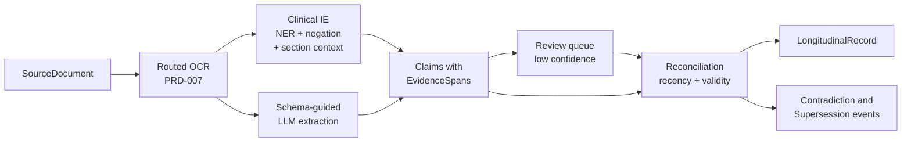

# PRD-010 — Clinical Grounding Pipeline

Status: Draft · Owner: DreamLab · Created 2026-07-17 · Realises PRD-000 (`main` demonstrator pivot — ingestion) · Supersedes: none

## Summary

Ingestion begins where PRD-007 ends. Each SourceDocument's OCR text is read by a clinical
information-extraction stack and a schema-guided LLM pass; the output is Claims — typed,
FHIR-mapped, each anchored to the exact source characters by an EvidenceSpan, scored for
confidence, bounded by a temporal validity interval. Claims reconcile into one LongitudinalRecord,
and Contradictions and Supersessions are detected here, at ingestion time, from typed events and
recency.

If you remember one thing: **extraction is assistive, not authoritative — every Claim carries its
evidence and its confidence, doubtful ones queue for a person before the record trusts them, and
nothing is ever silently overwritten.**

## Problem

OCR output is text with per-field confidence (PRD-007), but no clinical meaning. The Reading mesh
([PRD-011](./PRD-011-clinician-query-and-reading-mesh.md)) needs typed, temporally valid,
evidence-linked assertions, and clinical text resists naive extraction at every turn:

- Negation and context: "no chest pain" is not chest pain; a condition in a family-history
  section is not the patient's problem.
- Time: a two-year-old medication list is weaker evidence than last month's; an amended lab
  report replaces its predecessor without deleting it from the file.
- Conflict: the corpus ([PRD-009](./PRD-009-synthetic-patient-corpus.md)) deliberately contains
  contradictions and duplicates, because real records do. A pipeline that flattens them into one
  tidy answer has destroyed the demonstrator's material.
- Provenance: an assertion the clinician cannot trace to source characters is worthless to this
  audience. The EvidenceSpan is not metadata; it is the product.

## Goals

1. Run every SourceDocument through one flow: routed OCR (PRD-007) → clinical information
   extraction → schema-guided LLM extraction → Claims.
2. Give every Claim the full shape: typed value, FHIR mapping, EvidenceSpan, confidence, temporal
   validity interval.
3. Reconcile all Claims into one LongitudinalRecord per patient.
4. Detect Contradictions and Supersessions at ingestion, from typed events and recency — never
   from text similarity.
5. Route low-confidence Claims through the human review queue PRD-007 established, before the
   record treats them as fact.
6. Emit every pipeline step as an attributable, chain-verifiable audit event (PRD-006).

## Non-goals

- Entity-linking mechanics and terminology residency.
  [ADR-013](../adr/ADR-013-fhir-record-and-terminology-mount.md) owns the FHIR record shape, the
  dm+d floor with a user mount, and (on `main`) SNOMED/UMLS embedded on the box; this PRD consumes
  that decision.
- Model choice rationale and serving layout.
  [ADR-012](../adr/ADR-012-clinical-grounding-stack.md) owns why OpenMed + medspaCy +
  GLiNER-biomed, the rejected alternative, and the Python sidecar behind the TypeScript control
  plane.
- Query time. The mesh reads the record; this PRD only builds it.
- Training or fine-tuning clinical models.

## Users and jobs

| User | Job this does |
|---|---|
| Operator / admin | Watch ingest per document, clear the Claim review queue, see detection events |
| Reading mesh (PRD-011) | Consume the LongitudinalRecord and its evidence-linked Claims |
| Reviewer / compliance | Trace any Claim to its source characters and its extraction events |

## The pipeline



### OCR handoff

Ingestion consumes PRD-007's output: extracted text addressable by character offset, per-field
confidence, route already chosen per project. The character offsets are load-bearing — every
EvidenceSpan points into this text — so the OCR output for a SourceDocument is stored immutable;
re-running OCR produces a new version, never an in-place change.

### Clinical information extraction

Three tools, one job each. OpenMed NER (Apache-2.0) recognises clinical entities — conditions,
drugs, anatomy, and the rest of its pinned checkpoint families. medspaCy adds what NER alone
cannot: negation and section context, so "no chest pain" and a family-history mention are
qualified before they can become the patient's problems. GLiNER-biomed (Apache-2.0) is the
zero-shot fallback for entity types the pinned checkpoints do not cover. The stack runs in a
Python sidecar behind the TypeScript control plane; ADR-012 owns that decision and the rejected
commercial alternative.

### Schema-guided LLM extraction

The deterministic stack finds and qualifies entities; a schema-guided LLM pass assembles them into
candidate Claims against the FHIR-shaped schema — doses, date relations, and links between
entities that token-level NER does not produce. Output is constrained to the schema, and the pass
runs on the routed model like any other agent call: local or cloud, per project, per the same
switch discipline as PRD-007.

### The Claim

Named "Claim" because it can be contradicted or superseded; that mutability is the point.

```
Claim {
  value        typed clinical value (code, dose, quantity, date, text)
  fhir         mapping to a FHIR R4 resource and element
  evidence     EvidenceSpan { source_doc_id, char_span, quoted_passage }
  confidence   composed from OCR field confidence and extraction confidence
  validity     temporal interval the assertion holds for
}
```

### Reconciliation and detection

Claims fold into the LongitudinalRecord in event order, and detection is typed. Two medication
Claims for the same drug with overlapping validity and different doses raise a Contradiction. An
amended laboratory report raises a Supersession that closes the earlier Claim's validity interval.
Text similarity plays no part: similarity finds the passage most like the question, never the most
recent or the superseding one, and a longitudinal record turns on exactly that difference
([ADR-011](../adr/ADR-011-context-native-retrieval.md)). Superseded and refuted Claims are
retained with closed intervals, never deleted — the demonstrator's act 5 depends on showing the
history.

### Confidence and human review

A Claim's confidence composes the OCR field score with the extraction stack's own score. Below
threshold, the Claim queues for a person in the same review surface PRD-007 built — one queue, not
a second one — and the LongitudinalRecord does not treat an unreviewed low-confidence Claim as
fact. Review is on by default; silent wrong extraction is worse than a visible gap.

### Audit

Every stage — ingest, extraction, Claim creation, reconciliation, each detection, each review
decision — is an attributable event on the audit hash chain (PRD-006). A reviewer can replay
exactly how any assertion entered the record, and who or what put it there.

## Honest limits

- OpenMed's models are trained largely on biomedical literature and public benchmarks, not raw
  EHR prose. Expect degradation on NHS idiom, abbreviations, and OCR noise — which is why
  confidence scoring and review exist, and why the corpus's handwritten artefacts matter as a
  test.
- Negation and section handling is rule-based (ConText); constructions outside its rules will slip
  through. The schema-guided pass catches some; review catches more; neither catches all.
- Extraction is assistive, not authoritative. The pipeline proposes; the review queue and, at
  query time, the clinician dispose.

## Success criteria

- Every Claim in the record resolves to an EvidenceSpan whose quoted passage matches the source
  characters exactly.
- The six seeded patterns of PRD-009 produce their intended events: S1 and S5 raise Supersessions,
  S2 and S6 raise Contradictions, S3's duplicates are flagged with both documents' provenance
  kept, S4's cross-references are linked.
- No unreviewed Claim below the confidence threshold reaches the LongitudinalRecord as fact.
- Ingesting the same corpus twice detects the same seeds — deterministic enough to demo.
- One document's ingestion emits a complete, chain-verifiable audit trail attributed to the
  uploader and the pipeline identity.
- Scored against the Synthea bundle (PRD-009's ground truth), extraction recovers the seeded coded
  events at an agreed recall, with misses visible in the evaluation output rather than silent.

## Open questions (for the client brief)

- Is the confidence threshold per Claim type? A wrong allergy is worse than a wrong clinic date.
- Which FHIR resources are in scope for the first build — Condition, MedicationStatement,
  Observation, AllergyIntolerance, DocumentReference, Encounter, and what else?
- Where types alone cannot decide a conflict, does an LLM adjudicate at ingestion or is the pair
  left for the mesh to surface unresolved?

## Traceability

Binding ground truth: [../../demonstrator-brief.md](../../demonstrator-brief.md). Product shape:
[PRD-000](./PRD-000-product-shape.md). Upstream: PRD-007 (OCR, confidence, review queue),
[PRD-009](./PRD-009-synthetic-patient-corpus.md) (input corpus and ground truth). Downstream:
[PRD-011](./PRD-011-clinician-query-and-reading-mesh.md) (reads the record),
[PRD-008](./PRD-008-clinician-demonstrator.md) (acts 2–3). Decisions consumed:
[ADR-012](../adr/ADR-012-clinical-grounding-stack.md) (stack and sidecar),
[ADR-013](../adr/ADR-013-fhir-record-and-terminology-mount.md) (record and terminology),
[ADR-014](../adr/ADR-014-corpus-store-lexical-index-and-graph.md) (where Claims and text are
stored and indexed), [ADR-011](../adr/ADR-011-context-native-retrieval.md) (why ingestion-time
grounding). Audit: PRD-006. Domain model:
[DDD-004](../ddd/DDD-004-clinical-corpus-domain.md). Research: RuVector `project-state` digests
`docbox-research-openmed` and `docbox-research-retrieval`.
