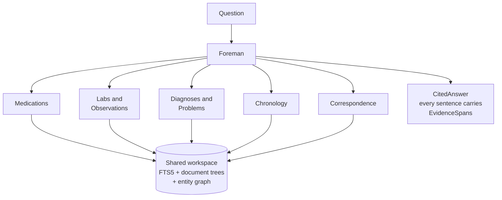

# PRD-011 — Clinician Query and Reading Mesh

Status: Draft · Owner: DreamLab · Created 2026-07-17 · Realises PRD-000 (`doctorBox` demonstrator pivot — query) · Supersedes: none

## Summary

A clinician asks a Question of the grounded record. A bounded Reading mesh of five Specialists —
Medications, Labs & Observations, Diagnoses & Problems, Chronology, Correspondence — is convened
by the existing Foreman, each holding its slice of the LongitudinalRecord in its own context. The
Specialists read, cross-check, and reconcile Claims on recency and validity, and the answer comes
back as a CitedAnswer: every sentence anchored to source passages by EvidenceSpans.

If you remember one thing: **the mesh reads the record in context and reconciles on recency and
validity, not similarity — the deterministic tools are the workspace it uses to find and cite
exact passages, not a retrieval backbone — and the pattern is affordable only because one
patient's record is near context-sized.**

## Problem

A clinician's question — "what is she taking, and why did the dose change?" — spans documents,
specialities, and time. Three things defeat the usual approaches:

- Similarity retrieval returns the passage most like the question, never the most recent or the
  superseding one, and a longitudinal record turns on exactly that difference. The full argument
  is [ADR-011](../adr/ADR-011-context-native-retrieval.md)'s; this PRD consumes it.
- A single sequential reader misses the cross-checks a longitudinal record demands — the
  medication answer that ignores the allergy note, the diagnosis that ignores the letter refuting
  it.
- An answer the clinician cannot verify against source is worthless to this audience. NHS
  guidance requires the clinician to review AI output; review requires sources at the sentence
  level, not a bibliography at the bottom.

## Goals

1. Resolve a Question with a bounded mesh of five named Specialists, coordinated by the Foreman on
   the engine seam the control plane already drives (PRD-003).
2. Give each Specialist its slice of the record in its own context, with cross-checking between
   Specialists before the answer is assembled.
3. Provide the deterministic tools as a shared workspace: the SQLite FTS5 (BM25) lexical index,
   the per-document hierarchical tree, and the typed, non-embedded entity graph
   ([ADR-014](../adr/ADR-014-corpus-store-lexical-index-and-graph.md)).
4. Reconcile on recency and temporal validity; surface Contradictions with both sources rather
   than resolving them silently.
5. Return a CitedAnswer whose every sentence carries EvidenceSpans — character-level provenance in
   the style of Anthropic's Citations mechanism.
6. Present the query surface as a panel in the interface domain, registered through the typed
   panel registry (ADR-009, ADR-010, DDD-003).
7. Record every Question and every answer as attributable audit events (PRD-006).

## Non-goals

- The rationale for rejecting a vector/embedding retrieval backbone, and the honest statement of
  where vector RAG is the right call. [ADR-011](../adr/ADR-011-context-native-retrieval.md) owns
  that decision; this PRD builds on it without re-arguing it.
- Population-scale, cross-patient, or multi-tenant query. One session, one LongitudinalRecord.
- Open medical conversation. The mesh answers from the record; where the record holds no evidence,
  the answer states the gap instead of filling it.
- Building the record ([PRD-010](./PRD-010-clinical-grounding-pipeline.md)) or the corpus
  ([PRD-009](./PRD-009-synthetic-patient-corpus.md)).

## Users and jobs

| User | Job this does |
|---|---|
| Clinician (audience) | Ask a Question, expand citations, judge the answer against its sources |
| Presenter / operator | Run queries in the demo; show the mesh working in the activity tree |
| Reviewer / compliance | Confirm each answer's provenance and the session's audit trail |

## The mesh

### The Specialists

| Specialist | Slice of the record it owns |
|---|---|
| Medications | Medication Claims, repeat lists, dose changes, allergy interplay |
| Labs & Observations | Pathology and radiology results, trends, corrected reports |
| Diagnoses & Problems | Condition Claims, working versus refuted diagnoses |
| Chronology | Event ordering, validity intervals, what changed when |
| Correspondence | The letters as documents — who told whom what, and when |

Bounded means bounded: these five, no dynamic spawning, no open-ended fan-out. Adding a Specialist
is a design change to this PRD, not a runtime event.

### Coordination

The Foreman decomposes the Question, convenes the relevant Specialists, collects their
evidence-backed findings, and has them cross-check before assembly — Medications against
Chronology on when a dose actually changed; Diagnoses against Correspondence on what was actually
communicated. The mesh runs on the same engine seam as every other agent workload and its work is
visible in the activity and agent tree, which is itself a demo affordance (PRD-008 act 4).

This Question, the Specialists' findings, and the resulting CitedAnswer form one **ReadingSession** —
the query-time unit of work and of audit ([DDD-004](../ddd/DDD-004-clinical-corpus-domain.md)). The
whole exchange records as one attributable, chain-verifiable episode (PRD-006), so a reviewer can
replay not just the answer but the reading that produced it.

### Shared workspace, not retrieval backbone

The deterministic tools are embedding-free and exact: FTS5/BM25 for identifiers, drug names,
dates, and codes; the per-document tree for navigating a letter's structure; the typed entity
graph — constructed by NLP and LLM at ingestion, never embedded — for following references between
documents. Specialists use them to pull exact passages into context and to anchor citations. The
distinction is the design: the record is read in context; the tools locate and cite, they do not
rank by similarity. ADR-014 owns the store and index.

### Reconciliation

Recency and validity, not similarity. Where one Claim supersedes another, the superseding Claim
governs and the answer can show the history. Where two valid Claims conflict, the answer surfaces
the Contradiction with both sources and their dates — the S2 seed (discharge list against GP
repeat list) is the canonical case, and PRD-008's act 5 stands on it.

### The CitedAnswer contract

Every sentence carries one or more EvidenceSpans: `source_doc_id` + character span + quoted
passage. In the panel, each sentence expands to its highlighted source. A sentence that cannot
carry evidence does not ship; the answer states the gap instead. One research caveat shapes the
contract: citation count correlates poorly with accuracy, so the contract is per-sentence
verifiable spans that a clinician can check in one click — never citation volume as reassurance.

### The query surface

A panel in the interface domain (DDD-003), registered through the typed panel registry (ADR-010)
under the slim-core rule (ADR-009): a question box, the answer with expandable citations, a
visible Contradiction indicator, and a link into the session's audit trail. No new surface
machinery; the panel system already exists and this is one more panel in it.

### The multidisciplinary-team framing

For the clinician audience the mesh is legible as an MDT: a lead convenes specialists who each
read the parts they own and cross-check before a shared conclusion. It mirrors how clinicians
already reason, which is why the harness idea lands without jargon. The analogy is a teaching
device, not a claim of clinical equivalence — the brief fixes that guard and the demo script keeps
it.

## Honest limits

- The mesh is assistive. A clinician verifies every answer against its cited sources; the design's
  job is to make that verification one click, not to make it unnecessary.
- The mesh is only as right as the record it reads. PRD-010's extraction limits flow through
  unchanged, and an unreviewed low-confidence Claim is as invisible to the mesh as it is to the
  record.
- Token economics: a mesh costs roughly an order of magnitude more tokens than a single reader.
  It is affordable here only because one patient's record is near context-sized in absolute
  terms. The pattern must not be copied to a large corpus — at 10⁴+ documents the economics
  invert and vector retrieval becomes the right call. ADR-011 states that boundary in full; this
  PRD's scope rule (one session, one LongitudinalRecord) is how the product honours it.

## Success criteria

- A Question over the demo corpus returns a CitedAnswer in which every sentence resolves to at
  least one EvidenceSpan whose quoted passage matches the source characters.
- A natural medications Question surfaces the S2 Contradiction with both sources and dates.
- A Question the record cannot evidence returns a stated gap, not a fabricated sentence.
- Where a superseded and a superseding Claim both match a Question lexically, the answer is
  governed by the superseding one — the recency test similarity retrieval fails by construction.
- The mesh convenes only the five named Specialists; its work appears in the activity tree and
  the audit chain, per Question.
- The panel registers through the typed registry with no change to the core (ADR-009, ADR-010).

## Open questions (for the client brief)

- Does the Foreman always convene all five Specialists, or select per Question? Cost against
  cross-check value, and the demo's legibility, pull in different directions.
- What answer latency can a live audience wear — seconds in silence, or a narrated wait while the
  activity tree fills?
- Do follow-up Questions hold session context (a genuine consultation feel), and what does
  multi-turn do to the token budget?

## Traceability

Binding ground truth: [../../demonstrator-brief.md](../../demonstrator-brief.md). Product shape:
[PRD-000](./PRD-000-product-shape.md). Upstream:
[PRD-010](./PRD-010-clinical-grounding-pipeline.md) (the record it reads),
[PRD-009](./PRD-009-synthetic-patient-corpus.md) (the seeds it surfaces). Consumed by:
[PRD-008](./PRD-008-clinician-demonstrator.md) (acts 4–5). Decisions consumed:
[ADR-011](../adr/ADR-011-context-native-retrieval.md) (context-native retrieval and the token
boundary), [ADR-014](../adr/ADR-014-corpus-store-lexical-index-and-graph.md) (workspace tools),
ADR-009 / ADR-010 (panel system), PRD-003 (engine seam). Audit: PRD-006. Interface domain:
DDD-003. Domain model: [DDD-004](../ddd/DDD-004-clinical-corpus-domain.md). Research: RuVector
`project-state` digests `docbox-research-retrieval` and `docbox-decision-context-native-mesh`.
